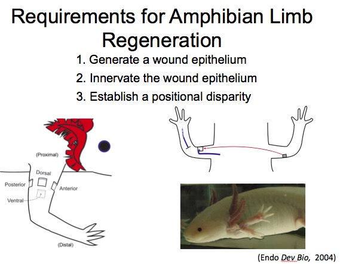
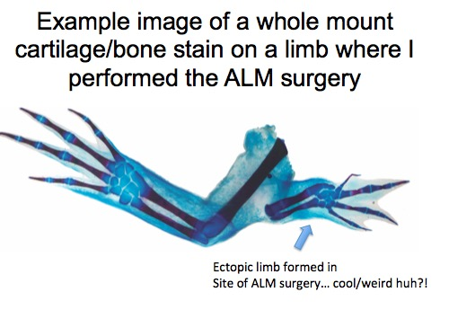
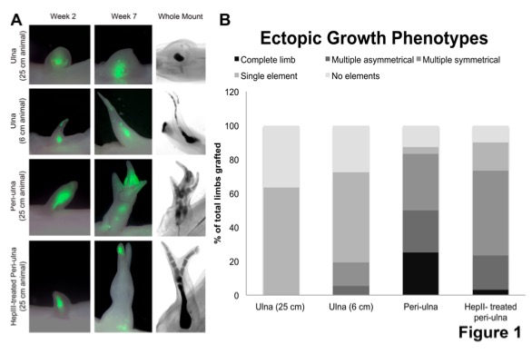
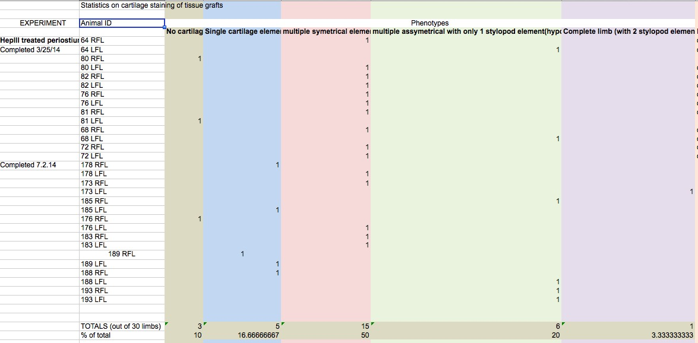

```{r setup, include=FALSE}
knitr::opts_chunk$set(echo = TRUE)
library(tidyverse)
library(readxl)
```

### You have Ascended. Others... have not.

You have spent almost half a semester immersing yourself in thinking about good data practice. You may not think you have, but I guaruntee that you now have a strict aversion to many data practices that you might have walked into the room with. You know, for example, that you will always endeavour to have your data in a long or wide format, with complete columns, reasonable NA values, and strong data validation. One value per cell! And so many more principles.  

Your past self and, frankly, many of your collaborators, are not at this level of transcendence. However, they are fabulous scientists producing juicy data.  
  
Today, we're going to look at a data set that looks not unlike something you might have produced in the past and walk through the steps of how to make it into something we can analyze!  

### The data

The data we're going to work with is from the [McCusker lab](https://www.umb.edu/mccuskerlab). It's a beautiful piece of work looking at limb regeneration in [Axoltls](https://en.wikipedia.org/wiki/Axolotl). These amphibians have incredible limb regeneration abilities. In essence, the idea of this experiment was to see if with some application of different compounds, different kinds of limb regrowth could be stimulated.





Based on where the limb was injured and whether a particular compound was applied, the researchers saw very different results of the types of limbs being formed. We want to take their data and recreate some of their iconic plots.



There's just one problem. The dataset is not in an easy to use format. You can [download the data](./data/ALM assay statistics.xlsx) and take a look. There are a lot of issues - although this is perfectly good if you are only working within excel.



### How do we attack datasets like this?

The first question you might have is, what do I do?!  Relax. Take a breath. Look at the dataset. Note any common features. Note anything that delimits sections. What needs to be modified in this data?  
  
Let's break the process down into steps.

1. What are the columns?  
2. Do we need to standardize column names or otherwise?  
3. Are there extra rows/values that can be eliminated?  
4. Do we need to fill in any missing data?  
5. Reshape and plot!

### The Columns

Let's begin by loading in the data, as well as loading up the tidyverse.

```{r start, message=FALSE}
library(tidyverse)
library(readxl)

axoltl <- read_excel("./data/ALM assay statistics.xlsx")

axoltl
```

Well that's no good. We notice instantly that the real column names are split between row 2 and 3. We can clean this up pretty easily by moving those names up and then getting rid of rows we don't need.

```{r colname_fix}
#move row 3 names to the top
names(axoltl) <- axoltl[3,]

#fix those last two
names(axoltl)[1:2] <- axoltl[2,1:2]

#get rid of rows we don't need
axoltl <- axoltl[-c(1:3),]

axoltl
```

WHOAH! Way better!

Now we can bare off the columns from NOTES on, which we don't need.

```{r notes_remove}
names(axoltl)

#We want column 8 onwards gone!
axoltl <- axoltl[,1:7]

axoltl
```

Lovely!

### Fixing up column names

So, column names are long and unweildy. Also, capitalization is odd. Let's make them use title capitalization Then let's make sure each one only has only two words.

```{r change_names}
names(axoltl) <- names(axoltl) %>%
  str_to_title() %>%
  str_replace("^([a-zA-Z0-9]+ [a-zA-Z0-9]+)(.*)", "\\1")

names(axoltl) 
```

Nice! String Substitution FTW!

### Getting Rid of Bad Rows and Reshape

Looking at the data in Excel, we see three problems - first, the "Completed" elements in the first column. Second, rows that are entirely NA. Third, rows that are 'totals'. The later two are easy, as they're a filter. Actually, we don't even have to worry about the blank rows, as `readxl` took care of that for us. Let's get rid of those rows entirely based on all of the action occuring in `Animal ID`. We'll make them capital at first to make life easier.

```{r remove_rows}
axoltl <- axoltl %>%
  mutate(`Animal Id` = str_to_upper(`Animal Id`)) %>%
  filter(!str_detect(`Animal Id`, "TOTAL"))
```

Nice, now, let's scrub anything in the Experiment column. We need to do something a little funny to add in NAs - either an ifelse with an NA or, str_replace offers a different solution

```{r scrub_completed}
axoltl <- axoltl %>%
  mutate(Experiment = str_replace(Experiment, ".*[cC]omple.*", NA_character_))
```

### Filling down
OK, we have a lot of missing values - both in the Experiment column and through the rest of the data set. How do we fix all of that up? Let's start with experiment - we can use `fill` from tidyr and set it to `down` in order to make the column fixed.

```{r fill_down}
axoltl <- axoltl %>%
  fill(Experiment, .direction = "down")
```

Now what about the rest? Well here's where gathering and spreading can be *very* useful.

Let's think about this data. Notice that every row only has 1 once. That's because the 1 means - this was the outcome from that treatment on this particular animal. So, what we want, is each animal to have the condition of its response. This means going from this wide format to a long format.

```{r reshape}
axoltl_long <- axoltl %>%
  gather(Response, Value, -Experiment, -`Animal Id`)

axoltl_long
```

Nice! Two notes. First, if you wanted to replace those NAs with 0s in the wide format, you'd do that here, and then reshape back to wide. But, in this case, we're going to eliminate anything that is NA, and then get rid of the Value column entirely, as we don't need it.

```{r filtering_long}
axoltl_long <- axoltl_long %>%
  filter(!is.na(Value)) %>%
  select(-Value)
```

### Plot!
OK! We're ready to plot the response! 

```{r plot}
ggplot(data=axoltl_long, aes(x=Experiment, fill=Response)) +
  geom_bar() +
  theme_bw(base_size=17) +
  theme(axis.text.x = element_text(angle=45, hjust=1)) 
```
