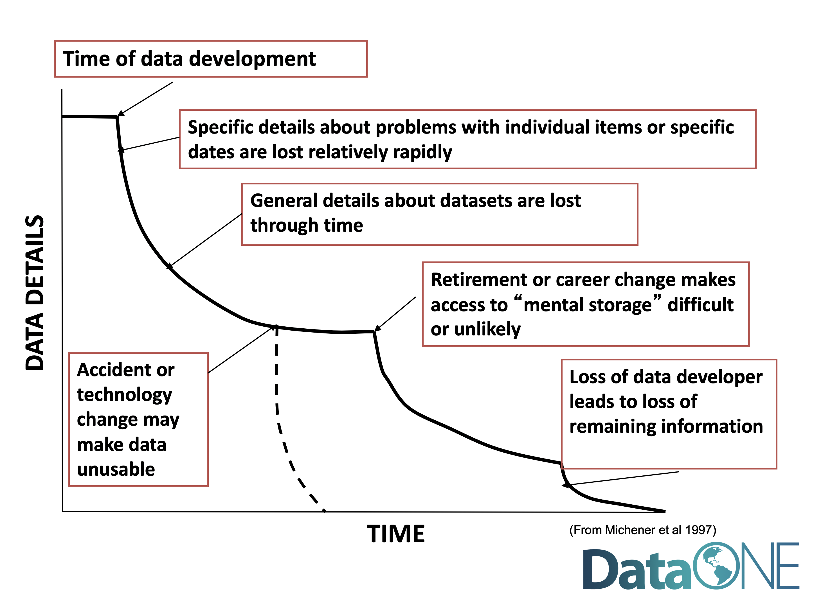
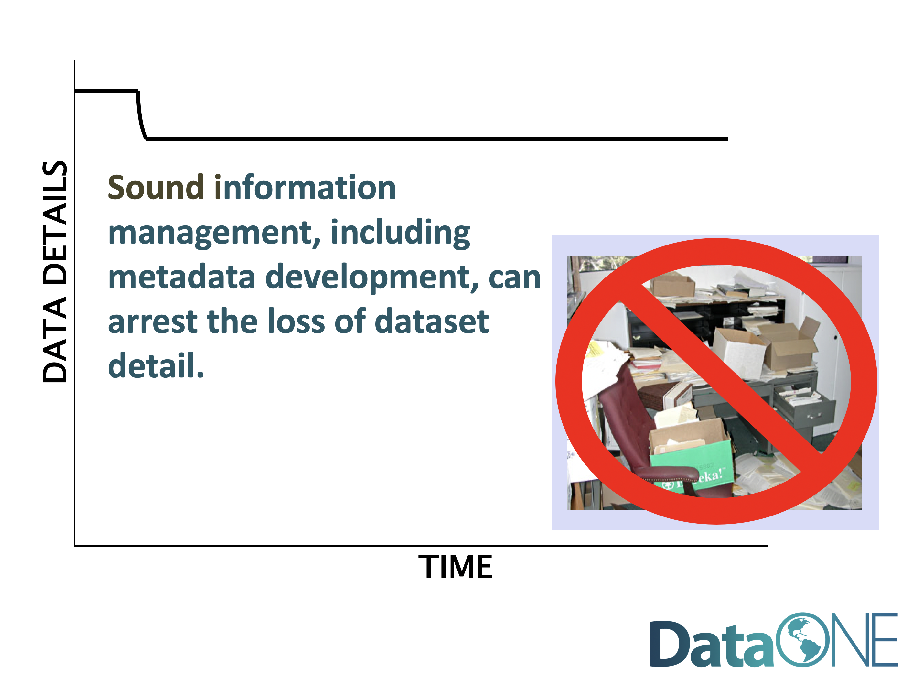
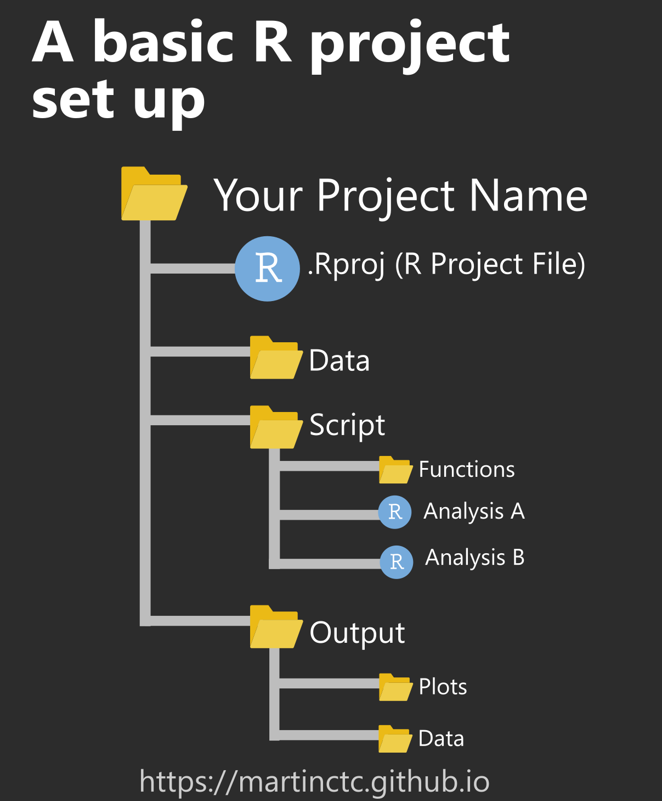
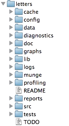
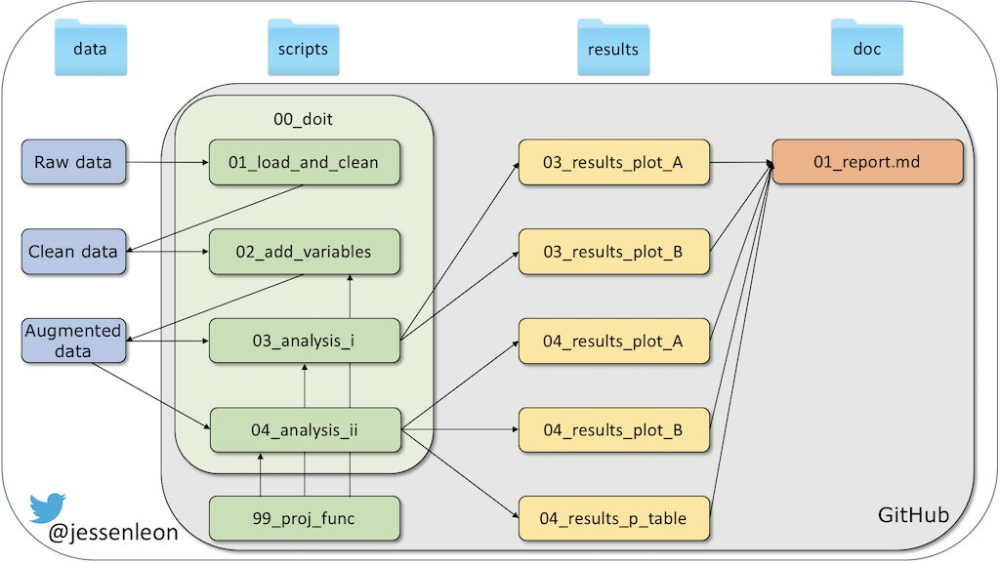
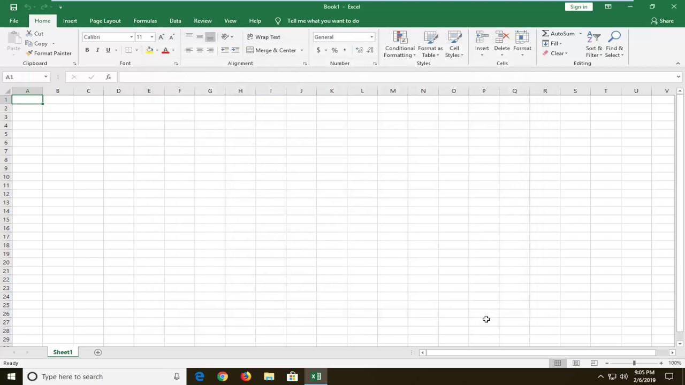
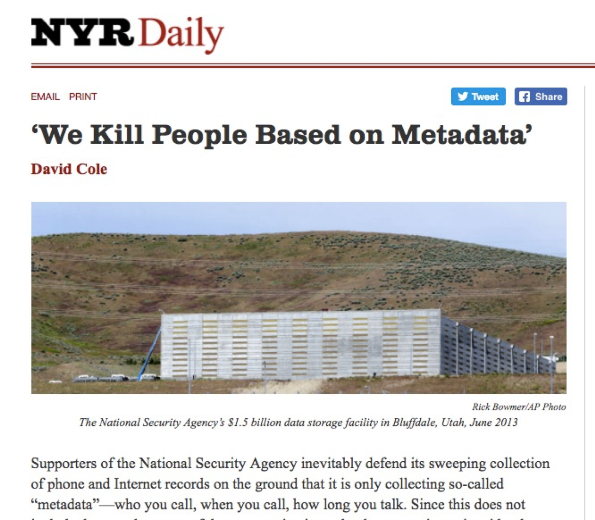
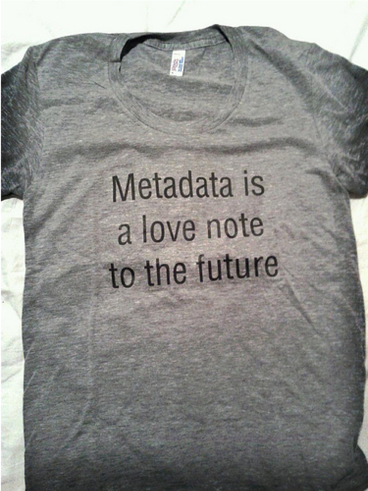

---
title:
css: style.css
output:
  revealjs::revealjs_presentation:
    reveal_options:
      slideNumber: true
      previewLinks: true
    theme: white
    center: false
    transition: fade
    self_contained: false
    lib_dir: libs
---
## {data-background="./Images/spreadsheets/o-THE-MATRIX-facebook.jpg" opacity="0.4"}
<Br><br><br><br><br><Br><br><br><br><br>
<h2 style="position: absolute; top:50%;  text-align: center; color:white">
<center>Getting your Data Into a Matrix</center></h2>


  ```{r prep, echo=FALSE, cache=FALSE, message=FALSE, warning=FALSE}
library(knitr)
opts_chunk$set(fig.height=5, fig.width=7, comment=NA, 
               warning=FALSE, message=FALSE, 
               dev="jpeg", echo=FALSE)
```

## You have collected your data - what now?
{width="85%"}

## What Can Happen to Data
{width="85%"}

## Fighting Information Entropy
{width="85%"}

## What Would Your Next Steps Be?
{width="85%"}

## Building an Environment for Data Storytelling
1. Project Directory Structure  
  
2. Building of a good spreadsheet  
  
3. More than just data...
  
4. Is this a good spreadsheet?

##  You, After Recording Data


## Why Think About Directory Structure
1. Directory structure organized your brain  
  
2. Easy to find what you need  
  
3. Makes versioning of files easier  
  
4. Provides natural project extensions

## Oh, the horror!


## At least some versioning, but...


## Getting there...


## A Full Workflow for a Huge Project


## How would you structure your environment?

1. Pick a partner.  
\
2. Concoct a made-up data collection adventure.  
\
3. Decide what elements you would want to use to create a good structured environment for your data analysis project.


## A Good Project Structure
<p align="left">
Top Level  
 |  
 |--- Data  
 <div class="fragment" style="text-align:left">|  
 |--- Scripts</div>  
 <div class="fragment" style="text-align:left">|  
 |--- Derived_Data</div>  
 <div class="fragment" style="text-align:left">|  
 |--- Figures</div>  
 <div class="fragment" style="text-align:left">|  
 |--- Reports</div>  
</p>

<div class="fragment"><center>Is this enough?</center></div>

## An alternate structure
{width="60%"}
<div class="fragment"><center>What is different here?</center></div>

## This can get very detailed

\
\
http://projecttemplate.net/


## Linking Structure to Workflow



## In General, Let's Use This
<p align="left">
Top Level  
 |  
 |--- Data  
 |--- Scripts  
 |--- Derived_Data  
 |--- Figures  
 |--- Reports
</p>


## Building an Environment for Data Storytelling
1. Project Directory Structure  
  
2. <font color="red">Building of a good spreadsheet</font>  
  
3. More than just data...
  
4. Is this a good spreadsheet?

## Spreadsheets Make the Wold Go 'Round
.svg.png)


## Within This Grid Is Power


## Two Main Styles of Data
- Long: Each row is a single measurement  
     - Many measurements per observation  
     - Multple columns describing specific observation and measurement  
\
\
- Wide: Each row is a complete observation
     - Many measurement types are columns

## Wide and Long Data


## Wide Data
{width="80%"}

- One Observation per row  
- All data fields are columns

## Long Data


- Each measurement 1 row  
- All information about measurement in row

## Hybrid Data


- Neither long nor wide
- Each row has multiple measurements…but also some unique qualities
- Each row is not a complete observation 

## Efficiency May Drive Data Sheet Design


## Efficiency May Drive Data Sheet Design


## Syncing Data Collection and Entry
{width="75%"}
  
<center>Wide or long?</center>


## Good Rules for Data Entry
- Columns should have only 1 type of data  
  
- One thing per cell
  
- No bare space  
  
- Consistent NA character  
   
- See Browman and Woo 2017 for many others

## A note on filenames
- Be descriptive  
  
- Make it machine readable (no spaces)  
  
- Date it  

## Initial Workbook Creation


## Initial Workbook Creation


<center>Wide or long or hybrid - your call</center>
<div style="font-size:12pt; position:absolute; left:0; bottom:-100px">Browman and Woo 2017</div>

## Can have multiple sheets with linked columns


<div style="font-size:12pt; position:absolute; left:0; bottom:-100px">Browman and Woo 2017</div>

## Just say no to blank cells


- Use NA, -, ., or something else **standard**

<div style="font-size:12pt; position:absolute; left:0; bottom:-100px">Browman and Woo 2017</div>


## Make Variable Names Simple

<div style="font-size:12pt; position:absolute; left:0; bottom:-100px">Browman and Woo 2017</div>


## Warning: Dates
  
  
- Use a Standard format  
- But, a Day, Month, and Year column is not a bad idea  
<div style="font-size:12pt; position:absolute; left:0;">https://xkcd.com/1179/</div>

## Do not use highlighting, formulae, etc

<div style="font-size:12pt; position:absolute; left:0; bottom:-100px">Browman and Woo 2017</div>

## 
\
\
<h1>OK, OK, I've Mastered Data Entry. Is that All?</h1>

\
\
\
<h1>Is Recording Data From a Sheet Enough?</h1>

## Building an Environment for Data Storytelling
1. Project Directory Structure  
  
2. Building of a good spreadsheet  
  
3.  <font color="red">More than just data...</font>  
  
4. Is this a good spreadsheet?

## Managing Data to Fight Information Entropy

## Metadata


## Metadata: Data Reporting
- WHO created the data?
- WHAT is the content of the data?
- WHEN were the data created?
- WHERE is it geographically?
- HOW were the data developed?
- WHY were the data developed?

## 


## 


## Metadata Tab


##  Get Extensive with Metadata

<div style="font-size:12pt; position:absolute; left:0; bottom:-100px">Browman and Woo 2017</div>

## A Simply Typology of Metadata
- Numerical
      - Continuous
      - Integers
      - Ordinal
\
- Controlled Vocabulary
      - Certain defined words with defined meanings
      - Has a reference ‘dictionary’

- Dates/Times
      - Many formats – POSIX 

- Raw Text

- Other Media


## Tab for Controlled Vocabularies


## Tab for Recording Changes after Initial Entry


## Building an Environment for Data Storytelling
1. Project Directory Structure  
  
2. Building of a good spreadsheet  
  
3.  More than just data...  
  
4. <font color="red">Is this a good spreadsheet?</font>

## Is this wide, long, other, or bad?


## What is bad practice here?


## What is wrong here?


## What is bad practice here?
{width="80%"}
