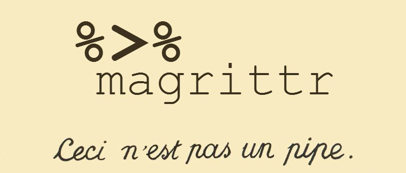
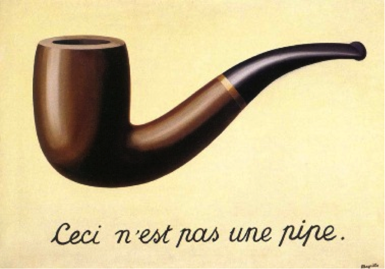

## {data-background="./Images/summarizing_data/many_salmon.png" opacity="0.4"}
<Br><br><br><br><br><Br><br><br><br><br>
<h2 style="position: absolute; top:50%;  text-align: center; color:white">
<center>Making Data Tell its Story</center></h2>


```{r prep, echo=FALSE, cache=FALSE, message=FALSE, warning=FALSE}
library(knitr)
library(readr)
library(dplyr)
library(magrittr)
library(ggplot2)
read_chunk("lectures/09_sampling_lecture.R")
theme_set(theme_light(base_size=16))

opts_chunk$set(fig.height = 6, fig.width = 7, comment=NA, 
               warning=FALSE, message=FALSE, 
               dev="jpeg", echo=FALSE)
               
suppressMessages(salmon <- read_csv('lectures/data/02e1cSockeyeFemaleBodyMass.csv'))
salmon %<>% mutate(river = rep(letters[1:6],nrow(salmon)/6),
                   mass_class = cut_interval(mass, 6))
```

## Where are we going?


## Groups of Topics

1. Our Data

2. Cleaning and Filtering our Data  

3. Summarizing counts functionally!  

4. How do we summarize our data?  
  
5. The split-apply-combine philosophy  
 

## How much does one salmon weigh?
{width="75%"}

Weight: 3.09kg


## How much do these salmon weigh?
{width="75%"}

`r salmon$mass[1:10]`

## What can we say about the weights of all of these salmon?
{width="75%"}

Pair up with someone and come up all of the information you can think of that would summarize this population.

## Our Data
```{r hist, fig.height=7}
img <- png::readPNG("lectures/Images/summarizing_data/salmon_population.png")
g <- grid::rasterGrob(img, interpolate=TRUE)

p <- ggplot(data = salmon, aes(x = mass)) + 
  geom_dotplot(binwidth = 0.05) + 
  coord_fixed(ratio = 0.05) + 
  ylim(0, 20)

p_all <- p  +
  annotation_custom(g, xmin=2.25, xmax=4, ymin=7)

p_all
```

## Groups of Topics

1. Our Data

2. <font color="red">Cleaning and Filtering our Data</font>  

3. Summarizing counts functionally!

4. How do we summarize our data?  
  
5. The split-apply-combine philosophy  

## What Data Do We Want?
```{r river_facet}
river_dots <- ggplot(data = salmon, aes(x = mass, group = river)) + 
  ggdist::stat_dots(color="black", fill = "black",
                    size = 1,
                    binwidth = NA) +

  facet_wrap(~river)

river_dots
```

## What Data Do We Want? Adults!
```{r river_facet_line}
river_dots +
  geom_vline(xintercept = 2, color = "red")
```


## Our Hero...


## Filtering
```{r filter, message=FALSE, warning=FALSE, echo=TRUE}
library(dplyr)

filter(salmon, mass > 2)
  
```

## Filtering
```{r filter2, message=FALSE, warning=FALSE, echo=TRUE}
filter(salmon, river == "a")
  
```

## Logical Operators


## Many Filters
```{r filter3, message=FALSE, warning=FALSE, echo=TRUE}
filter(salmon, river == "a" & mass > 3)
```  

## Groups of Topics

1. Our Data

2. Cleaning and Filtering our Data  

3. <font color="red">Summarizing counts functionally!</font>

4. How do we summarize our data?  
  
5. The split-apply-combine philosophy  


## Counting
```{r count}
count(salmon)
```

## Nesting Functions: Ugly! Hard to Read!

```{r filter4, message=FALSE, warning=FALSE, echo=TRUE}
count( filter(salmon, river == "a" & mass > 3) )
```  

## Introducing The Pipe

```{r filter5, message=FALSE, warning=FALSE, echo=TRUE}
filter(salmon, river == "a" & mass > 3) |>
  count()
```  


## Sidebar - the pipe!


## Sidebar - the pipe!


## Pipes pass an object as the first argument to a function
```{r pipe_demo, echo = TRUE}
5 |> sum(4)

salmon |> count()
```

## Pipes and Functional Programming

- We often thing in terms of do this, then then, then this  
\
- Programming that way requires overwriting a lot of objects  
\
- It gets.... messy

## Functional Programming Workflow
```{r cp_comments, eval = FALSE, echo=TRUE}
#filter the salmon data by river

#filter the salmon data by mass

#get the count of the salmon
```


## Functional Programming Can get Verbose
```{r fp_old, eval = FALSE, echo=TRUE}
#filter the salmon data by river
salmon_filtered <- filter(salmon, river == "a") 

#filter the salmon data by mass
salmon_filtered <- filter(salmon_filtered, mass > 3) 

#get the count of the salmon
count(salmon_filtered)
```

## Pipes Make Programs Read Like Language!

```{r fp_new, eval = FALSE, echo=TRUE}
salmon_filtered <- salmon |>
  
  #filter the salmon data by river
  filter(river == "a") |>
  
  #filter the salmon data by mass
  filter(mass > 3) |>
  
  #get the count of the salmon
  count()
```

## Groups of Topics

1. Our Data

2. Cleaning and Filtering our Data  

3. Summarizing counts functionally!  

4. <font color="red">How do we summarize our data?</font>  
  
5. The split-apply-combine philosophy  


## Summary Properties of a Sample
- Measures of Central tendency: Mean, Median, Mode

- Measures of Variation: Standard Deviation, Percentiles

- Measures of Precision of Estimating the Above: Standard Error 
  

## Central Tendancy: Mean {.bigger}
&nbsp;  
&nbsp;  
<center> 
$\bar{Y} = \frac{ \displaystyle \sum_{i=1}^{n}{y_{i}} }{n}$
</center>

$\large \bar{Y}$ - The average value of a sample  
$y_{i}$ - The value of a measurement for a single individual   
n - The number of individuals in a sample  


## Median - Dead Center

```{r sampSort, echo=FALSE}
sort(salmon$mass[1:10])
```
<Br><br>
<div class="fragment"> Middle Value = 50th Percentile = 0.5 Quantile = Median<Br>good for non-normal data</div>  
<br><br>
<div class="fragment"> 
```{r median, echo=FALSE}
median(salmon$mass)
```
</div>

## Central Tendancies
```{r central1}
p_all +
  geom_vline(color="blue", xintercept=mean(salmon$mass), lwd=2) +
  geom_vline(color="red", xintercept=median(salmon$mass), lwd=2) +
  labs(subtitle = "Blue = Mean, Red = Median")
```


## What about population-level variability?
```{r central_var1}
p_all +
  geom_vline(color="blue", xintercept=mean(salmon$mass))
```

<div class="fragment">What is the range of 2/3 of the population?</div>


## What about population-level variability? 2/3 of the population is within 1SD
```{r central_var2}
p_all +
  geom_vline(color="blue", xintercept=mean(salmon$mass), lwd=2) +
  geom_vline(color="orange", xintercept=mean(salmon$mass) + sd(salmon$mass), lwd=2) +
  geom_vline(color="orange", xintercept=mean(salmon$mass)- sd(salmon$mass), lwd=2) 
```

What is the range of 2/3 of the population?

## Sample Properties: Variance
How variable was that population?
$$\large s^2=  \frac{\displaystyle \sum_{i=1}^{n}{(Y_i - \bar{Y})^2}} {n-1}$$

* Sums of Squares over n-1  
* n-1 corrects for both sample size and sample bias  
* Units in square of measurement...

## Sample Properties: Standard Deviation
$$ \large s = \sqrt{s^2}$$  

* Units the same as the measurement
* If distribution is normal, 67% of data within 1 SD
* 95% within 2 SD

## Visualizing Measures of Variability

```{r central}
p_all +
  geom_vline(color="blue", xintercept=mean(salmon$mass), lwd=2) +
  geom_vline(color="orange", xintercept=mean(salmon$mass) + sd(salmon$mass), lwd=2) +
  geom_vline(color="orange", xintercept=mean(salmon$mass)- sd(salmon$mass), lwd=2) +
  geom_vline(color="purple", xintercept=mean(salmon$mass) + 2*sd(salmon$mass), lwd=2) +
  geom_vline(color="purple", xintercept=mean(salmon$mass)- 2*sd(salmon$mass), lwd=2)  +
  labs(subtitle = "Orange = 1 SD, Purple = 2 SD")
```

## Variability: Quantiles/Percentiles and Quartiles

```{r sampSort, echo=FALSE, comment=NA}
```
<br><br>
<div class="fragment">
Quantiles:
```{r quantiles, echo=FALSE, comment=NA}
quantile(salmon$mass, c(0.05, 0.1, 0.5, 0.90, 0.95))
```
</div>

<br><br>
<div class="fragment">
Quartiles (quarter-quantiles):
```{r quartiles, echo=FALSE, comment=NA}
quantile(salmon$mass)
```
</div>

## Boxplots


## Boxplot of One Population
```{r boxplot}
qplot(x=1, mass, data = salmon, geom="boxplot")
```

## Boxplot of Many Populations
```{r boxplot_many}
img_ak <- png::readPNG("lectures/Images/summarizing_data/alaska_rivers.png")
g_ak <- grid::rasterGrob(img_ak, interpolate=TRUE)

ggplot(data = salmon,
       aes(x = river, y = mass)) +
  geom_boxplot() +
  annotation_custom(g_ak, xmin=6.2, ymin=3.5) + 
  ylim(c(0,6)) +
  scale_x_discrete(limits=letters[1:8], labels=c(letters[1:6], "", ""))
```

## Meh, I still like ridgelines
```{r ridgeplot}
library(ggridges)

ggplot(salmon, aes(x=mass, y=river, fill=after_stat(x))) +
  geom_density_ridges_gradient(bandwidth=0.2) +
  scale_fill_viridis_c(name = "mass (kg)", option = "C") +
  scale_y_discrete(limits=letters[1:7], labels=c(letters[1:6], ""))

```

## Groups of Topics

1. Our Data

2. Cleaning and Filtering our Data  

3. Summarizing counts functionally!  

4. How do we summarize our data?  
  
5. <font color="red">The split-apply-combine philosophy</font>  
 

## Where are we going?


## Split-Apply-Combine
- Filtering and working with one chunk of the data is not enough  
  
- We often want to summarize information about many groups  

## Split-Apply-Combine


## Two Questions
1. What is the mean and variation of salmon by river?

2. For each size class of salmon, how many are in each river?

## What do we need to know to learn about rivers?
```{r, echo = TRUE}
# make a data frame of summary info

  # start with data

  # group them (somehow?) by river

  # for each river, summarize the data to mean and sd
```

## Start with the data
```{r, eval = FALSE, echo = TRUE}
# make a data frame of summary info
salmon_rivers <- 
  
  # start with data
  salmon |>
  
  # group them (somehow?) by river

  # for each river, summarize the data to mean and sd
```

## The group_by() function
```{r, eval = FALSE, echo = TRUE}
# make a data frame of summary info
salmon_rivers <- 
  
  # start with data
  salmon |>
  
  # group them (somehow?) by river
  group_by(river)

  # for each river, summarize the data to mean and sd
```

## Summarizing
```{r, echo = TRUE}
# make a data frame of summary info
salmon_rivers <- 
  
  # start with data
  salmon |>
  
  # group them (somehow?) by river
  group_by(river) |>

  # for each river, summarize the data to mean and sd
  summarize(
    mean_mass = mean(mass),
    sd_mass = sd(mass)
  )
```


## Show the result(yes, this could have been piped)
```{r arrange, echo=TRUE}
arrange(salmon_rivers, mean_mass)
```

## Other way! Descending
```{r arrange2, echo=TRUE}
arrange(salmon_rivers, desc(mean_mass))
```

## What can we do with this?
```{r plot_groups, echo=FALSE}
ggplot(salmon_rivers,
       aes(x=river,
           y = mean_mass,
           ymin=mean_mass-sd_mass,
           ymax=mean_mass+sd_mass)) +
  geom_linerange(color = "darkred", lwd=1.1) +
  geom_point(size=4)
```

## What about mass class per river?

```{r, echo = TRUE}
salmon_mass_count <- 
  
  # start with data
  salmon |>
  
  # make mass classes
  mutate(mass_class = cut_interval(mass, 5))
```

## Mass Classes from cut_interval()

```{r, echo = TRUE}
salmon_mass_count
```

## OK, What next for count by class and river?
```{r, eval = FALSE, echo = TRUE}
salmon_mass_count <- 
  
  # start with data
  salmon |>
  
  # make mass classes
  mutate(mass_class = cut_interval(mass, 5)) |>
  
  #.....
```

## A Plan of Attack
```{r, eval = FALSE, echo = TRUE}
salmon_mass_count <- 
  
  # start with data
  salmon |>
  
  # make mass classes
  mutate(mass_class = cut_interval(mass, 5)) |>
  
  # group by class and river
  
  # summarize with a count
```

## Let's do it with n()
```{r, echo = TRUE}
salmon_mass_count <- 
  
  # start with data
  salmon |>
  
  # make mass classes
  mutate(mass_class = cut_interval(mass, 5)) |>
  
  # group by class and river
  group_by(mass_class, river) |>
  
  # summarize with a count
  summarize(number_fish = n())
```


## Ungrouping to cleanup
```{r, warning=FALSE, echo = TRUE}
salmon_mass_count <- 
  
  # start with data
  salmon |>
  
  # make mass classes
  mutate(mass_class = cut_interval(mass, 5)) |>
  
  # group by class and river
  group_by(mass_class, river) |>
  
  # summarize with a count
  summarize(number_fish = n()) |>
  
  ungroup()
```

## Visualize our Result
```{r, echo = FALSE, echo = FALSE}
ggplot(salmon_mass_count,
       aes(x = number_fish,
           color = river, 
           y = mass_class)) +
  geom_point(position = position_dodge(width = 0.6)) +
  scale_color_brewer(palette = "Set2")
```

## A Solid Workflow!


## If we have time - let's see it live!
1. What are things you want to know about different rivers in the salmon data?  
  
2. What are things you want to know about different size classes in the salmon data?
