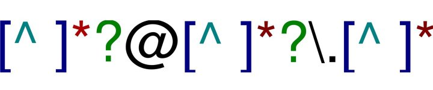

---
title:
css: style.css
output:
  revealjs::revealjs_presentation:
    reveal_options:
      slideNumber: true
      previewLinks: true
    theme: white
    center: false
    transition: fade
    self_contained: false
    lib_dir: libs
---
## 
<Br><Br><br><br>
<h2><center>Wrangling and Cleaning Strings</center></h2>



```{r prep, echo=FALSE, cache=FALSE, message=FALSE, warning=FALSE}
library(knitr)
library(tidyverse)
library(stringr)
library(ggplot2)
theme_set(theme_bw(base_size=16))

opts_chunk$set(fig.height=5, fig.width=7, comment=NA, 
               warning=FALSE, message=FALSE, 
               dev="jpeg")

library(readxl)
portal <- read_excel("./data/portal_messy_regexp.xlsx")
```

##


## Just Another Day Loading Data...
```{r read_data, eval=FALSE, message=FALSE, warning=FALSE}
library(tidyverse)
library(readxl)
library(visdat)

portal <- read_excel("./data/portal_messy_regexp.xlsx")
vis_dat(portal) +
  theme(text = element_text(size=13))

```


## The Nigtmare Scenario
```{r read_data, echo=FALSE}
```

## The Nightmare Scenario
```{r str}
str(portal)
```

## What to Do?
1. Deal with NA Values  
     - na handlers and filter

2. Diagnose remaining problems  
  
3. Remove unneeded characters  
     - string matching  
     - Basic regular expressions  
  
4. Remove errand line spaces and other cruft
     - More advanced regular expressions  
  
5. Fix names

## NAs
```{r isna}
is.na(NA)
```

Useful tool! Can work with filter!

## If we want NAs to be 0...
```{r na_zero, eval=FALSE}
portal <- portal %>%
  mutate(Weight = ifelse(is.na(Weight), 0, Weight))
```

This can be a horrible idea if NAs are real

## Or, filter, if NA rows are not useful
```{r filter_na}
portal <- portal %>%
  filter(!is.na(Weight))
```

BUT! Also not useful if we find that NA information is in other column

## General Notes on NAs
- NAs are easy to filter out or replace  
     - `dplyr::filter()`  
     - `na.omit()`  
  
- But, there may be info in NAs  
     - Info might hide in other columns!
  
- Many functions have methods for handling NAs  
  
- BUT - NA values can propogate through functions if not careful  
  
- Filter NAs last, and only if they are actually a problem


## What to Do?
1. Deal with NA Values  
     - na handlers and filter

2. <font color="red">Diagnose remaining problems</font>  
  
3. Remove unneeded characters  
     - string matching  
     - Basic regular expressions  
  
4. Remove errand line spaces and other cruft
     - More advanced regular expressions  
  
5. Fix names

## Diagnosis
- What lines have problems?  
  
- Look at unique values in those lines  

```{r plots}
unique(portal$Plot)
````

## Species
```{r species}
unique(portal$Species)
```

## Weight
```{r Weight}
unique(portal$Weight)
```

## Problems with unique?
- Unique only works if a small numbe of unique entries  
  
- Need a more general tool  
  
- Can brute force to find bad entries

## Brute force conversion
```{r convert}
bad_weight <- as.numeric(portal$Weight)
```
<div class="fragment">
```{r which}
which(is.na(bad_weight))
```
</div>

## Problems with conversion
- Shows you which problems occur  
  
- Can then fix one by one  
  
- But, can't show you which problems are systematic

## What to Do?
1. Deal with NA Values  
     - na handlers and filter

2. Diagnose remaining problems  
  
3. <font color="red">Remove unneeded characters  
     - string matching  
     - Basic regular expressions</font>  
  
4. Remove errand line spaces and other cruft
     - More advanced regular expressions  
  
5. Fix names

## Finding Bad Strings

```{r stringr}
library(stringr) #loaded with tidyverse

str_detect(portal$Weight, "g")
```

## What is the problem?

```{r view}
str_view(portal$Weight, "g")
```

UH OH! NA!

## What is the problem
```{r viewMA}
str_view(na.omit(portal$Weight), "g")
```

## Basic String Matching
- Can match on one letter or many letters  

```{r match}
x <- c("apple", "bananna", "orange")
str_view(x, "nn")
```

## What about ANY character?
- Sometimes we want flexibility

```{r match_any}
str_view(x, "a.")
```

a followed by any character

## How do you match .?
- Escapes for matching special characters, such as punctuation, \, [], (), "", '', and more

```{r match_r}
x_p <- c("apple.", "bananna.", "orange.")
 
str_view(x_p, "\\.")
```

## Exercise
1. How would you match the sequence "'\?  
  
2. What patterns will the regular expression \..\..\.. match? How would you represent it as a string?


## Beginning and End of Lines
<b>First you get the power, then you get the money...</b>

```{r start1}
str_view(x, "a")
```

## Beginning and End of Lines
<b>First you get the power, then you get the money...</b>

```{r start2}
str_view(x, "^a")
```

## Beginning and End of Lines
<b>First you get the power, then you get the money...</b>

```{r end}
str_view(x, "e$", match=TRUE)
```

## Exercise
Given the corpus of common words in `stringr::words`, create regular expressions that find all words that:

1. Start with “y”.  
2. End with “x”  
3. Are exactly three letters long. 
4. Have seven letters or more.  

Since these list relong, you might want to use the `match=TRUE` argument to `str_view()` to show only the matching or non-matching words.``

## Solutions
```{r}
# 1. 
str_view(words, "^y", match=TRUE)
```

## Solutions
```{r}
# 2. 
str_view(words, "x$", match=TRUE)
```

## Solutions
```{r}
# 3. 
str_view(words, "^...$", match=TRUE)
```

## Solutions
```{r}
# 4. 
str_view(words, ".......", match=TRUE)
```


## Exercise

Come up with regexprs that will show you problems in Species and Weight


## Solutions
```{r}
str_view(na.omit(portal$Weight), "g", match=TRUE)
```

## Solutions
```{r}
str_view(na.omit(portal$Weight), "\\(", match=TRUE)
```


## Species
```{r}
str_view(na.omit(portal$Species), "\\_", match=TRUE)
```

## More Generalized Search Strings
1. `\d`: matches any digit.  
2. `\s`: matches any whitespace (e.g. space, tab, newline).  
3. `[abc]`: matches a, b, or c.  
4. `[^abc]`: matches anything except a, b, or c.  
5. `[a-z]`: matches a through z (but only lowercase)  

## So, who has a character in weight?
```{r weight_problems}
str_view(na.omit(portal$Weight), "[a-zA-Z]", match=TRUE)
```

<div class="fragment">Still not general enough...</div>

## So, who has a character in weight?
```{r weight_problems2}
str_view(na.omit(portal$Weight), "[^\\d]", match=TRUE)
```

## Either or and groups
- Use `()` and `|` to try alternate groups

```{r grey}
str_view(c("grey", "gray"), "(ey|ay)")
```

## Exercises
Create regular expressions to find all `stringr::words` that:  
  
1. Start with a vowel.  
  
2. End with ed, but not with eed.  
  
3. End with ing or ise.  

## Solutions
```{r}
#starts with a vowel
str_view(words, "^[aeiou]")
```

## Solutions
```{r}
#End with ed, but not eed
str_view(words, "[^e]ed", match=TRUE)
```

## Solutions
```{r}
#End with ing or ise
str_view(words, "(ing|ise)$", match=TRUE)
```

## Greedy Matching
- ? - 0 or 1  
- + - 1 or more  
- * - 0 or more  
- {n} - exactly n  
- {n,} - n or more  
- {,m} - at most m  
- {n,m} - between n and m  

## Example: Double Ps
```{r}
str_view(x, "p{2}")
```


## Group Matching
- `()` creates a groups  
- You can then refer to it with \\1 (if the first group), \\2, etc...

```{r}
#double letters
str_view(x, "([a-z])\\1")
```

## Exercise
Create regular expressions to find all words that:

1. Start with three consonants.
2. Have three or more vowels in a row.
3. Have two or more vowel-consonant pairs in a row.
4. That only contain consonants. (Hint: thinking about matching “not”-vowels.)

## Solutions
```{r}
#starts with three consonants
str_view(words, "^[^aeiou]{3}", match=TRUE)
```

## Solutions
```{r}
#Have three or more vowels in a row
str_view(words, "[aeiou]{3,}", match=TRUE)
```

## Solutions
```{r}
#Have two or more vowel-consonant pairs in a row.
str_view(words, "([aeiou][^aeiou]){2,}", match=TRUE)
```


## Solutions
```{r}
#That only contain consonants.
str_view(words, "(^[^aeiou])+$", match=TRUE)
```