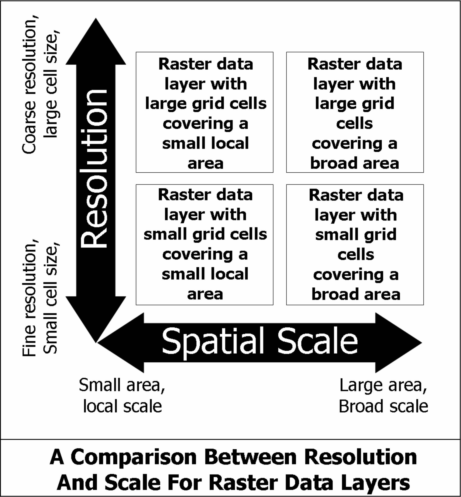

---
title:
css: style.css
output:
  revealjs::revealjs_presentation:
    reveal_options:
      slideNumber: true
      previewLinks: true
    theme: white
    center: false
    transition: fade
    self_contained: false
    lib_dir: libs
---
## 
<br>
<h2><center>GIS and R</center></h2>


```{r prep, echo=FALSE, cache=FALSE, message=FALSE, warning=FALSE}
library(knitr)
library(tidyverse)
library(sf)
library(raster)
library(ggmap)
library(ggplot2)
library(readxl)
library(broom)
theme_set(theme_bw(base_size=16))

#register with goog api
#https://developers.google.com/maps/documentation/geocoding/get-api-key
key <- read.csv("~/goog.api") %>% names()
register_google(key = key)
#knitr::opts_knit$set(root.dir = 'Lectures')
#stop(list.files())


opts_chunk$set(fig.height=5, fig.width=7, comment=NA, 
               warning=FALSE, message=FALSE, error=FALSE, results='hide',
               dev="jpeg", echo=FALSE)


heart_disease <- read_excel("Lectures/data/hd_all.xlsx", 
                            na="Insufficient Data")


## A Disclaimer
#{width=50%}

```


## Plankton Data from the Plum Island Estuary
```{r, results = 'asis', echo = FALSE}
plank <- read_excel("Lectures/data/EST-PR-PlanktonChemTax.xls", 
                    sheet=2, na="NA")

plank |> head() |> knitr::kable(digits = 2) |> kableExtra::kable_styling()
```

## Trends only tell us so much
```{r}
ggplot(plank, aes(x=Salinity, y = TotalChlA)) +
  geom_point()
```

## Trends only tell us so much
```{r}
ggplot(plank, aes(x=Distance, y = Salinity)) +
  geom_point()
```

## You're starting to see something spatial...
```{r}
ggplot(plank, aes(x=Distance, y = Salinity, color=TotalChlA, size=TotalChlA)) +
  geom_point() +
  scale_color_viridis_c(option="D")
```

## Often within Relationships is a Pattern
```{r underly, echo=FALSE}
ggplot(plank, aes(Longitude, Latitude, color=Salinity, size=TotalChlA)) +
  geom_point() +
  scale_color_viridis_c(option="B")
```
<div class="fragment">What do you learn from this that is new?</div>

## Context!
```{r ggmap, echo=FALSE, cache=TRUE, message=FALSE, warning=FALSE, height = 9}
#pie_map <- #get_googlemap(center=c(-70.823316, 42.728316), zoom = 12)
#get_stadiamap(center=c(-70.823316, 42.728316), zoom = 12)
plank_sf <- st_as_sf(plank, coords = c("Longitude", "Latitude"), crs = 4326)

ggplot() +
  ggspatial::annotation_map_tile(zoom = 12) +
  geom_sf(data = plank_sf, 
             mapping = aes(color=Salinity, size=TotalChlA)) +
  scale_color_viridis_c(option="B") +
  coord_sf()

```
<div class="fragment">What do you learn from this that is new?</div>


## What does this tell you that a bar plot would not?
```{r hartmap, cache=TRUE}
#from http://rspatial.r-forge.r-project.org/gallery/
# library(maptools)
# nc <- readShapePoly(system.file("shapes/sids.shp", package="maptools")[1], proj4string=CRS("+proj=longlat +datum=NAD27"))
# 
# spplot(nc, c("SID74", "SID79"), names.attr = c("1974","1979"),
#     colorkey=list(space="bottom"), scales = list(draw = TRUE),
#     main = "SIDS (sudden infant death syndrome) in North Carolina", 
#     as.table = TRUE)

countymap <- map_data("county")

countymap <- countymap %>%
  rename(State = region,
         County = subregion)

heart_disease <- heart_disease %>%
  dplyr::mutate(State = tolower(State), 
         County = tolower(County))


heart_disease_map_data <- right_join(heart_disease, countymap) %>%
  st_as_sf(coords = c("long", "lat"), crs = st_crs("+init=EPSG:4326"))%>%
  group_by(State, County, group) %>%
  summarise(geometry = st_combine(geometry), Death_Rate = Death_Rate[1]) %>%
  st_cast("POLYGON")

heart_map <- ggplot(data=heart_disease_map_data, 
       mapping = aes(fill = Death_Rate, group = group)) +
  geom_sf(color = NA) +
  ggthemes::theme_map()

heart_map +
  scale_fill_viridis_c(option = "B")
```
```{r eval = FALSE, echo = FALSE}
## What does this tell you that a bar plot would not?
#{width=65%}
```

## Objectives

1. What is spatial data and how is it unique/new?  
2. What is vector data?  
3. What is raster data?  
4. What is a projection?  

## Types of Spatial Data


## Points are Coordinates
```{r points, echo=FALSE}
ggplot(plank, aes(Longitude, Latitude)) +
  geom_point() 
```

## Properties of Coordinates
- An x and y value  
- A Projection  
- An extent (minimum and maximum)  
- Additional Information

## Projections and Coordinate Reference Systems


## Extent 
{width=95%}

## Additional Information in Points!
```{r points_colors, echo=FALSE}
ggplot(plank, aes(Longitude, Latitude, color=Salinity, Size = TotalChlA)) +
  geom_point() +
  scale_color_viridis_c(option="B") +
  theme_minimal()
```


## Lines Can Also Contain Information
```{r lines_color, echo=FALSE}
ggplot(plank, aes(Longitude, Latitude, color=Salinity, lwd = TotalChlA)) +
  geom_line() +
  scale_color_viridis_c(option="B")+
  theme_minimal()
```


## As can Polygons
```{r polymap}
heart_map +
  scale_fill_viridis_c(option = "B") +
  theme_minimal()
```

## Objectives

1. What is spatial data and how is it unique/new?  
2. <font color = "red">What is vector data?</font>  
3. What is raster data?  
4. What is a projection?  

## Many Ways of Representing the Same Data


## Vector Data
{width = "75%"}

## More Complex Vector Data
{width = "85%"}

## Points
```{r points_colors, echo=FALSE}
```

## Lines (Paths)
```{r lines, echo=FALSE}
ggplot(plank, aes(Longitude, Latitude)) +
  geom_line() 
```


## One Polygon

```{r one_polygon}
ggplot(data=heart_disease_map_data[1,]) +
  geom_sf(color = "black") + 
  theme_minimal()
```

## Two Polygons

```{r two_polygon}
ggplot(data=heart_disease_map_data[1:2,]) +
  geom_sf(color = "black") + 
  theme_minimal()
```

## Many Polygons

```{r many_polygon}

ggplot(data=heart_disease_map_data[c(1,2,5,7,9,12),]) +
  geom_sf(color = "black") + 
  theme_minimal()
```

## Many Polygons

```{r all_polygon_nocolor}
ggplot(data=heart_disease_map_data) +
  geom_sf(color="black") + 
  theme_minimal()
```

## This is just vector data

```{r polymap}
```

## Exercise: Identify these Vector Types

```{r, echo = FALSE, message=FALSE, warning=FALSE}
NE.States.Boundary.US <- st_read("Lectures/data/US-Boundary-Layers/Boundary-US-State-NEast.shp")|> st_make_valid()
lines_HARV <- st_read("Lectures/data/HARV/HARV_roads.shp")
point_HARV <- st_read("Lectures/data/HARV/HARVtower_UTM18N.shp")

ggplot() +
   geom_sf(data = NE.States.Boundary.US , aes(color ="color"), 
       show.legend = "line") +
     scale_color_manual(name = "", labels = "State Boundary", 
       values = c("color" = "gray18")) +
  geom_sf(data = point_HARV, aes(shape = "shape"), color = 
     "purple") +
    scale_shape_manual(name = "", labels = "Fisher Tower", 
       values = c("shape" = 19)) +
  ggtitle("Fisher Tower location in Harvard Forest field site") + 
    theme(legend.background = element_rect(color = NA)) 
```

## Exercise: Identify these Vector Types

```{r, echo = FALSE, message=FALSE}
ggplot(lines_HARV) +
  geom_sf() +
  geom_sf(data = point_HARV, aes(shape = "shape"), color = 
     "red")
```

## Objectives

1. What is spatial data and how is it unique/new?  
2. What is vector data?  
3. <font color = "red">What is raster data?</font>  
4. What is a projection?  


## Rasters

{width=75%}

## Rasters versus Vector Files


## Rasters versus Vector Files

{width=90%}

## Raster Stacks/Bricks


## Multi-band Raster Data = RGB image!
{width=95%}

## Individual Bands
```{r demonstrate-RGB-Image, echo=FALSE}
# Use stack function to read in all bands
RGB_stack_HARV <- stack("Lectures/data/HARV_raster/RGB_Imagery/HARV_RGB_Ortho.tif")

names(RGB_stack_HARV) <- c("Red Band", "Green Band", "Blue Band")

grayscale_colors <- gray.colors(100,
start = 0.0,
end = 1.0,
gamma = 2.2,
alpha = NULL)

# Create an RGB image from the raster stack
plot(RGB_stack_HARV,
col = grayscale_colors,
axes = FALSE)

```

## Composite Image
```{r plot-RGB-now, echo=FALSE, message=FALSE }
# Create an RGB image from the raster stack
original_par <- par() # create original par for easy reversal at end
par(col.axis = "white", col.lab = "white", tck = 0)
plotRGB(RGB_stack_HARV, r = 1, g = 2, b = 3,
axes = TRUE)
box(col = "white")

```

## With rasters, we have to think of  Resolution
{width=95%}


## Resolution v. Extent (scale)
{width=75%}


## Why Rasters Versus Vector Formats
<p align="left">
**Filesize**: Advantage Vector (smaller!)  
  
**Depth of Detail**: Advantage Raster  
  
**Ease of Use in Analysis**: Advantage Raster  
  
**Ease of Reprojection/Scaling**: Advantage Vector  
  
**Ease of Creation**: Advantage Raster
</p>

## Objectives

1. What is spatial data and how is it unique/new?  
2. What is vector data?  
3. What is raster data?  
4. <font color = "red">What is a projection?</font>  


## Projections and Coordinate Reference Systems
{width=95%}

## Projections and Coordinate Reference Systems


## Components of a CRS

CRS information has three components:

* **Datum:** A model of the shape of the earth.  
     - In this workshop, we will use the
[WGS84
datum](https://www.linz.govt.nz/data/geodetic-system/datums-projections-and-heights/geodetic-datums/world-geodetic-system-1984-wgs84)  
\
* **Projection:** A mathematical transformation of the angular measurements on a
round earth to a flat surface (i.e. paper or a computer screen).  
\
* **Additional Parameters:** e.g., center of the map. 

## A datum is the choice of fruit to use

  

[Image source](https://github.com/MicheleTobias/R-Projections-Workshop)

## A projection is how you peel your orange and then flatten the peel
  

[Image source](http://blogs.lincoln.ac.nz/gis/2017/03/29/where-on-earth-are-we/)

## A PROJ4 string includes the following

* **proj=:** the projection of the data
* **zone=:** the zone of the data (this is specific to the UTM projection)
* **datum=:** the datum use
* **units=:** the units for the coordinates of the data
* **ellps=:** the ellipsoid (how the earth's  roundness is calculated) for
the data

## UTM Zones


## You can do a lot with those parameters


See Jason Davies's Map Projection Transitions - https://www.jasondavies.com/maps/transition/

## Exercise: Reading a PROJ4 String
Here is a PROJ4 string for one of the datasets we will use in this workshop:  
\
`+proj=utm +zone=18 +datum=WGS84 +units=m +no_defs`  
`+ellps=WGS84 +towgs84=0,0,0`  
\
 
* What projection, zone, datum, and ellipsoid are used for this data?
* What are the units of the data?
* Using the map above, what part of the United States was this data collected from?

## Need help choosing a projection
See http://projectionwizard.org/ 

{width=80%}

## Additional Resources for Learning
* [Geocomputation with R](https://geocompr.robinlovelace.net/) by Lovelace et al.  
     - Great online book covering materials here in depth  
\
* [Spatial Data Science](http://r-spatial.org/book) by Edzer Pebsma and Roger Bivand
     - Online book in progress by authors of many R spatial packages   
     - Covers emerging packages, such as `stars` for spatio-temporal rasters
