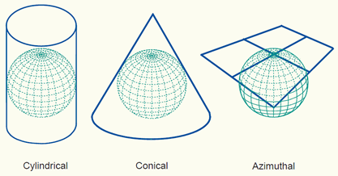

###R for GIS

R is a great tool in the world of geospatial analyses. There are a number of powerful packages that allow us to load, process, analyze, and visualize geospatial data. 

###What is Geospatial Data?
Any data that has a geographic component is considered geospatial data. These components are often some form of coordinates, but could also be an address, zipcode, country, etc.   

Geospatial data takes two forms: raster and vector data.  

* **Raster Data**: The data is divided into cells (in the case of digital data, pixels), each of which contains values that represent data. Common raster datasets include things like elevation or land use maps.  

* **Vector Data**:  Represents spatial features with points, lines, and polygons (think map pins, roads, and state borders, resptively). For anyone who has some GIS background, shapefiles are vector data.   

Today we will cover the basics of GIS with an introduction to raster data.

###Rasters


These pixel values can represent many types of data. Land use could be encoded such that "1" represents agricultural land, "2" rural areas, "3" is forest, "4" water, and so on. They can also be continuous measurements, such as elevation. Consider this map:

  

This is a barebones plot of a raster. Not much to look at yet, but you can still derive information from this; a rough picture of hills and valleys has emerged, even with zero processing!  

More on this next week, but one way of cleaning this up would be to reduce elevation measurements down into categories and then plot the categories:

  

###Raster Components
One common form that raster data comes in is called the GeoTIFF. You may have encountered `.tif` files before - originally created as a standard format for output of scanners, TIFFs essentially store images as rasters. GeoTIFFS are simply TIFFs that contain additional spatial metadata. Tis metadata includes:  

* Coordinate reference system
* Spatial extent
* Value for missing data (what gets filled in when a cell has no value)
* Image resolution 

Lets load up a raster and take a look. First, you will need two packages: raster and rgdal.

```{r load libraries and data, message=FALSE, cache = TRUE}
library(raster)
library(rgdal)

DSM_HARV <- raster("./data/HARV_dsmCrop.tif")
```

Lets take a look at what's in this raster.  
**Note** In this case, we're not going to use `str()`. `str()` gives us wayyyyyy too much info about the underlying data structure and as a result is pretty unreadable. We get a much more useful summary by simply typing the name of the raster object.

```{r raster structure}
DSM_HARV
```

Lets break this down:  
**Class** and **dimensions** are self explanatory: this object is a raster and it is 1367 by 1697 pixels, with a total of 2319799 cells.     
**Resolution** tells us the resolution in generic units. Checking the `units` component of the coord. ref system tells us tat `units=m`, making each pixel of this raster 1 square meter.  

**Extent** is the overall area covered by the raster, reported as maximum and minimum x and y values - if you were to draw a box around your raster, these points would define the corners.    

**Coord. ref.** Contains information about the coordinate reference system that the raster is stored in (more on this in just a minute, but this is where information like map projection is found).  We can reference the crs of a raster object directly using `crs()`.  
```{r crs}
crs(DSM_HARV)
```  

**Data source** is the local path to the file abnd **names** is the filename.  

**Values** is a summary of the range of values - in this case it is the maximum and minimum elevation.  If this is not already present, use `setMinMax()` to calculate it. Maximum and minimum values can be directly referenced with `maxValue()` and `minValue()`. 

###Coordinate Reference Systems
Lets take a brief step back from R and talk about coordinate reference systems.  **ALL** maps are approximations because the Earth is round and they are flat. There are many different map projections and each one flattens the earth with a different method. There are three main categories, defined by what shape the globe is "projected" on to before being "unfolded".  

  

Within these types, there exist a multitude of different projections. No one projection is perfect and it is up to the user to determine the correct one. They differ in how they distort the image: some distort area, some distort form(shape), some distort distance, and others attempt to compromise across all of these.  This is deep topic and I encourage you to check out [this page](http://axismaps.github.io/thematic-cartography/articles/projections.html) for more details.  

Here's a projection grab-bag: note how these representations of the USA differ.  

  


One important projection to be aware of is the **Universal Transverse Mercator** projection, or **UTM**. When projecting to UTM, the globe is separated into 60 zones, with each one being separately projected and flattened. The benefit of this system is that distortion within each zone is minimized, allowing further operations to be done without having involved math and/or multiple reprojection steps. The downside to this approach is that working with data that spans multiple UTM zones can be very cumbersome.   


  


**NOTE**: Map projections can be misleading!  

<iframe width="560" height="315" src="https://www.youtube.com/embed/KUF_Ckv8HbE" frameborder="0" allow="autoplay; encrypted-media" allowfullscreen></iframe>  


###Histogram
One good way to take a quick look at the data behind a raster is with a histogram. 
```{r histogram}
#quick and dirty histogram
hist(DSM_HARV)
```  

Note that warning message: Rasters can get big. Biiiiiiiiig. Really big. Ours is "only" 2319799 pixels, so we could, if we wanted, force the histogram to use all of them. Do not do this for big rasters or R will crash. 

```{r big histogram, cache = TRUE}
hist(DSM_HARV, maxpixels = ncell(DSM_HARV))
```

One reason to check a histogram of your raster is to help find any outliers. Often no data (NA) is recorded as some extreme value, typically -9999. This raster seems fine!  

###No Data  

Similar to NAs, there is a difference between data that is not there vs, classified as "No Data". If default values are used, R will render these as (usually) black pixels. If the NoDataValue is properly set in the raster properties, R will simply ignore those cells when plotting. 


###Bands
So far we have only looked at a raster that contains one set of values: elevations for one time point. Many rasters contain multiple observations. These could be a combination of things such as elevation, vegetation, and precipitation, each contained in its own band. Bands are almost always used with remote sensing products with each band being a wavelength of light (red, green, blue, near IR, etc).  

  
We can see how many bands are in our raster with `nlayers()`

```{r bands}
nlayers(DSM_HARV)
```  


###Closing note about checking raster metadata and workflow
As we said, rasters can get very large. It takes several minutes per band to load a landsat scene into R-studio on my laptop, and I can only have a few of them loaded at once. The `GDALinfo()` function can make our lives much easier by reading only the metadata in to R without loading the entire file. This becomes very powerful when you can skim a massive collection of rasters and create a list of specific files that match desired criteria. 

```{r gdal info}
rgdal::GDALinfo("./data/HARV_dsmCrop.tif")
```
 
 

