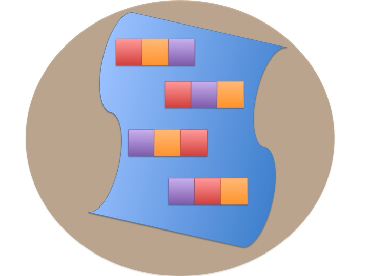
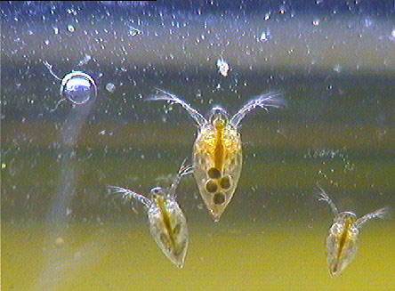
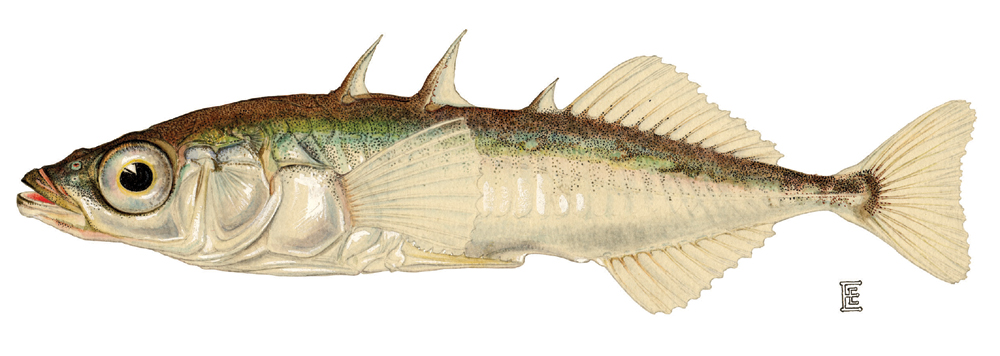

class: center, middle
background-image: url("Images/mlr/plate_spinners.jpg")

# .white[Multiple Predictors in a Model]

```{r setup, message=FALSE, warning=FALSE, echo = FALSE}
library(tidyverse)

library(ggplot2)
library(GGally)
library(ggthemes)
library(patchwork)
library(ggdag)
library(gridExtra)


library(car)
library(broom)
library(knitr)
library(emmeans)
library(modelr)
library(rsample)


opts_chunk$set(fig.height=7, 
               fig.width = 10,
               fig.align = "center",
               comment=NA, 
               warning=FALSE, 
               echo = FALSE,
               message = FALSE)


options(htmltools.dir.version = FALSE)
theme_set(theme_classic(base_size=22))
```

```{r xaringan-themer, include=FALSE, warning=FALSE}
library(xaringanthemer)
style_mono_light(
  base_color = "#23395b",
  colors = c(
  red = "#f34213",
  purple = "#3e2f5b",
  orange = "#ff8811",
  green = "#136f63",
  white = "#FFFFFF"
  )
)
```

---

# So Many Ways to Build a Model

1. Multiple Predictors  
  
2. Many Types of Categories
  
3. Many Models and Cross-Validation  

---

# Where we ended - One Predictor and Go!
.large[

$$y_i \sim \mathcal{N}(\widehat{y_i}, \sigma^2)\\
\widehat{y_i} = \beta_0 + \beta_1  x$$

]

```{r pufferload}
puffer <- read.csv("./data/16q11PufferfishMimicry Caley & Schluter 2003.csv") %>%
  mutate(resemblance = 5-resemblance)
```

```{r puffershow, fig.height = 5}
pufferplot <- ggplot(puffer, 
                     mapping=aes(x=resemblance, y=predators)) +
  ylab("Predator Approaches per Trial") + 
  xlab("Resemblance to Toxic Pufferfish\n1 = Low, 4 = High")  +
  geom_point(size = 3) 

pufferplot + stat_smooth(method = "lm")
```

---

# Where we ended - This Model Works for Means!
.large[

$$y_i \sim \mathcal{N}(\widehat{y_i}, \sigma^2)\\
\widehat{y_i} = \beta_0 + \beta_1  x$$

]


```{r two_trts, fig.height = 5}
puffer_t <- puffer %>%
  filter(resemblance %in% c(1,4)) %>%
  mutate(resemblance_trt = ifelse(resemblance==4, "Similar", "Not Similar"),
         resemblance_dummy = ifelse(resemblance==4, 1,0))

ggplot(puffer_t,
       aes(x = resemblance_dummy, y = predators)) +
  geom_point(size = 3) +
  ylab("Predator Approaches per Trial") + 
  xlab("")  +
  stat_smooth(method = "lm") +
  scale_x_continuous(breaks = c(0,1), 
                     labels = c("Not Similar",
                                "Similar"),
                     limits = c(-0.3,1.3))
```


---

# Where we ended - Many Means, Many 0/1s! So.... Many Slopes?
.large[

$$y{ij} \sim \mathcal{N}(\widehat{y_{ij}}, \sigma^2)\\
\widehat{y_{ij}} = \beta_0 + \sum\beta_j  x_{ij}$$
]

```{r aovplot, fig.height = 5}
puffer <- puffer %>% 
  mutate(resemblance_c = as.character(resemblance))

puffer_aov_data <- 
  bind_cols(puffer,
            model.matrix(predators ~ resemblance_c,
                         data = puffer) %>% as_tibble)

ggplot(puffer_aov_data,
            aes(x = resemblance_c, y = predators)) +
    ylab("Predator Approaches per Trial") + 
  xlab("Resemblance to Toxic Pufferfish\n1 = Low, 4 = High")  +
  geom_point(size = 3, color = "grey") +
  stat_summary(color = "black", fun.data = mean_cl_boot) +
  stat_summary(color = "black", fun = mean, geom = "line",
               group = 1, lwd = 1.5)
```

---

# One-Way ANOVA Graphically


.large[

$$y_{ij} \sim \mathcal{N}(\widehat{y_{ij}}, \sigma^2)\\
\widehat{y_{ij}} = \beta_0 + \sum\beta_j  x_{ij}$$
]

---
# Multiple Linear Regression?


--

- Note no connection between predictors, as in ANOVA. 

--

- This is ONLY true if we have manipulated variables so that there is no relationship between the two. This is not often the case!


---
# Multiple Linear Regression


--

- Curved double-headed arrow indicates COVARIANCE between predictors that we must account for.  

--

- MLR controls for the correlation - estimates unique contribution of each predictor controlling for the other.

--

- I like to think of it as holding the other predictor at its mean, or 0, or anything!

---
# Multiple Linear Regression - We've Seen This Before!

.large[

$$y{i} \sim \mathcal{N}(\widehat{y_{i}}, \sigma^2)\\
\widehat{y_{i}} = \beta_0 + \sum\beta_j  x_{ij}$$

]


---
background-image: url("Images/mlr/fires.jpg")
background-size: cover

<div style="bottom:100%; text-align:left; background:goldenrod"><h4>Five year study of wildfires & recovery in Southern California shur- blands in 1993. 90 plots (20 x 50m)</h4>
(data from Jon Keeley et al.)</div>

---

# What causes species richness?

- Distance from fire patch 
- Elevation
- Abiotic index
- Patch age
- Patch heterogeneity
- Severity of last fire
- Plant cover

---

# Many Things may Influence Species Richness

```{r keeley_pairs}
keeley <- read.csv("data/Keeley_rawdata_select4.csv")
ggpairs(keeley)
```

---

# Our Model

$$Richness_i \sim \mathcal{N}(\widehat{Richness_i}, \sigma^2)\\
\widehat{Richness_i} =\beta_{0} + \beta_{1} cover +\beta_{2} firesev + \beta_{3}hetero$$

```{r dagmlr, fig.height = 5, fig.width = 9}

set.seed(2021)
dagify(richness ~ cover + firesev + hetero + error,
                   labels = c("richness" = "richness",
                              "firesev" = "firesev",
                              "cover" = "cover",
                              "firesev" = "firesev",
                              "error" = "error"),
                  exposure = "richness",
                  outcome = "richness",
                  latent = "error") %>%
ggdag_classic() + 
  theme_dag_gray() +
  scale_color_viridis_d(guide = "none") +
  guides(shape = "none", color = "none")
```

---

# Fit with Our Engine: Ordinary Least Squares
### It's just another linear model!

.large[

```{r mlr, echo=TRUE}

klm <- lm(rich ~ cover + firesev + hetero, data=keeley)

klm_out <- augment(klm)
```

or.....
 
```{r, echo = TRUE}
library(parsnip)
mod <- linear_reg() %>%
  set_engine("lm") %>%
  fit(rich ~ cover + firesev + hetero, data=keeley)

mod_out <- mod %>%
  pluck("fit") %>%
  augment()
```

]

---
# Does Your Model Match Your Data?

```{r ggplot_dist}
klm_out %>%
  select(rich, .fitted) %>%
  pivot_longer(everything()) %>%
ggplot(aes(x = value, color = name)) +
  geom_density(size = 1.5) +
  scale_color_few()
```


---

# Are There Weird Patterns in Your Residuals?
```{r mlr_resid}
performance::check_model(klm, check = c("linearity", "normality"))
```

---


If your predictors are correlated at > 0.8.... are they really independent predictors?

---
# The Variance Inflation Factor

```{r multico}
performance::check_collinearity(klm)
```

--

- Basically, you look at how much all predictors explain each other ( $R^2$ of lots of mlr fits)  

--

- 5-10 is... not good. Greater, you have set fire to your inferential train

---

# What To Do If You've Caused a Fire

--

- Cry

--

- Drop a predictor

--

- Transform a predictor, if it is appropriate
---

# Did Our PredictorS Matter?

F = (MS model with predictor - MS model without)/MS Residual  
<br>
Where MS is a measure of variability (Sums of squares/DF)  

```{r mlr_f}
Anova(klm) %>%
  tidy()%>% 
  knitr::kable(digits = 2) %>%
  kableExtra::kable_styling("striped")
```

---

# What are the Association Between Predictors and Response?


```{r coeftab}
tidy(klm)[,1:3]%>% 
  knitr::kable(digits = 2) %>%
  kableExtra::kable_styling("striped")
```

- **Intercept:** If all predictors are 0, a plot will have 1.68 species approach on average.

--

- **Cover:** Holding fire severity and heterogeneity constant, a 1 unit increase in cover is associated with an increase in 15.6 species


--

- **Fire Severity:** Holding cover and heterogeneity constant, a 1 unit increase in fire severity is associated with an loss of 1.82 species


--

- **Heterogeneity:** Holding fire severity and cover constant, a 1 unit increase in heterogeneity is associated with an increase in 70 species

---

# Visualize Each Predictor Holding Others at the Median or Mean

```{r visreg}
vr <- visreg::visreg(klm, gg = TRUE) 

grid.arrange(arrangeGrob(vr[[1]], vr[[2]], vr[[3]], ncol = 2))
```

---

# Or Build a Plot That Shows the Implication of Selecting Certain Values - a Counterfactual Plot

```{r counterfact, fig.height = 5}

pred_info <- crossing(cover = seq(0,1.5, length.out=100),
                      firesev=c(2,5,8)) %>%
  crossing(hetero=c(0.5, 0.8)) %>%
  modelr::add_predictions(klm, var="rich") %>%
  dplyr::mutate(hetero_split = hetero)

ggplot(pred_info, mapping=aes(x=cover, y=rich)) +
  geom_line(lwd=1.5, mapping=aes(color=factor(firesev), group=paste(firesev, hetero))) +
    facet_wrap(~hetero_split) +
  geom_point(data=keeley %>% 
               dplyr::mutate(hetero_split = ifelse(hetero<mean(hetero), 0.5, 0.8))) +
  theme_bw(base_size=14)

```

---

# So Many Ways to Build a Model

1. Multiple Predictors  
  
2. .red[ Many Types of Categories ]
  
3. Many Models and Cross-Validation  

---
class: center, middle


---
# Compare These Models

### Multiple Linear Regression:

$$y_{ij} \sim N(\widehat{y_{ij}}, \sigma^{2} )$$
$$\widehat{y_{ij}} = \beta_{0} + \sum \beta_{ij}x_{ij}$$ 

### Mutiway ANOVA:

$$y_{ijk} \sim N(\widehat{y_{ijk}}, \sigma^{2} )$$ 
$$\widehat{y_{ijk}} = \beta_{0} + \sum \beta_{ij}x_{ij} + \sum \beta_{ik}x_{ik}$$  


$$x_{ij} \; \mathrm{and} \; x_{ik} = 0,1$$

---
# Multiway Model = More Than One Treatment Type
## For example: A Randomized Controlled Blocked Design




---

# Effects of Stickleback Density on Zooplankton Replicated in Different Lakes (Blocks)
<br><br>
.pull-left[

]

.pull-right[

]

---
# Effects of Both Treatment and Block

```{r zooplankton_boxplot}
zoop <- read.csv("./data/18e2ZooplanktonDepredation.csv") %>%
  mutate(block = factor(block))
zoop_lm <- lm(zooplankton ~ treatment + block, data=zoop)

zoop %>%
  pivot_longer(c(treatment, block)) %>%
  ggplot(aes(x = value, y = zooplankton)) +
  geom_boxplot() +
  facet_wrap(vars(name), scale = "free_x") +
  labs(x="")
```

---
# It's All 0s and 1s

Data Prepped for Model
```{r}
model.matrix(zooplankton ~ treatment + block-1, data = zoop) %>%
  head() %>% 
  kable() %>%
  kableExtra::kable_styling("striped")
```

---
# Put it to the Test: F-Test
```{r zanova}
broom::tidy(anova(zoop_lm))%>%
    rename(F = statistic) %>%
  kable(digits = 3) %>%
  kableExtra::kable_styling("striped")
```

$R^2$ = `r round(summary(zoop_lm)$r.squared, 3)`

---
# Comparison of Differences at Average of Other Treatment(s)

```{r lsmeans}
zoop_em <- emmeans(zoop_lm, "treatment")

contrast( zoop_em, "tukey", adjust="tukey") %>%
  kable(digits = 3) %>%
  kableExtra::kable_styling("striped")

```


---

# And a Plot!

```{r plot_zoop_em}
zoopdat <- zoop_em %>%
  as_tibble() %>%
  rename(zooplankton = emmean)

ggplot(data = zoop,
       aes(x = treatment, y = zooplankton)) +
  geom_point(alpha = 0.7, color = "grey", size = 4) +
  geom_pointrange(data = zoopdat, 
                  aes(ymin = lower.CL,
                      ymax = upper.CL),
                  color = "red", size = 2)
```

---
# If you really wanted to...

```{r plot_zoop_em_2}
zoopdat <- emmeans(zoop_lm, ~treatment + block) %>%
  as_tibble() %>%
  rename(zooplankton = emmean)

ggplot(data = zoop,
       aes(x = treatment, y = zooplankton,
           shape = block)) +
  geom_point(color = "grey", size = 2,
             position = position_dodge(width = 0.5)) +
  geom_pointrange(data = zoopdat, 
                  aes(ymin = lower.CL,
                      ymax = upper.CL),
                  color = "black",
                  position = position_dodge(width = 0.5))
```


---

# So Many Ways to Build a Model

1. Multiple Predictors  
  
2. Many Types of Categories
  
3. .red[Many Models and Cross-Validation]  


---
background-image: url("Images/mlr/fires.jpg")
background-size: cover

<div style="bottom:100%; text-align:left; background:goldenrod"><h4>Five year study of wildfires & recovery in Southern California shur- blands in 1993. 90 plots (20 x 50m)</h4>
(data from Jon Keeley et al.)</div>

---

# What causes species richness?

- Distance from fire patch 
- Elevation
- Abiotic index
- Patch age
- Patch heterogeneity
- Severity of last fire
- Plant cover

---

# WHAT PREDICTORS SHOULD I USE?


---
# The Second Inferential Track!

  
![:col_header Hypothesis Testing, 
  Model Comparison, 
  Bayesian Model Implications
  ]
--
![:col_list 
  Deductive Inference,
  Predictive Inference,
  Inductive Inference
]
--
![:col_list 
  Uses probabilities of overlap with a point hypothesis,
  Uses tests of model performances on new data,
  Uses probability distributions of parameters and simulation
]


---

# Predictive Ability: A Way to Differentiate Between Model Performance

- Fit of a model seems like a good place to start...

--

- BUT - $R^2$ is specific to the data *you used to fit the model.

--

- We need something more objective!

--

- How about how well our model does at predicting new data?


---

# But we Don't HAVE any New Data: Training, Testing, and Cross-Validation

1. Fit a model on a **training** data set

2. Evaluate a Model on a **TEST** data set

3. Compare predictive ability of competing models with MSE, Deviance, etc.

---

# Common Out of Sample Metrics

$MSE = \frac{1}{n}\sum{(Y_i - \hat{Y})^2}$  
    - In units of sums of squares

$RMSE = \sqrt{\frac{1}{n}\sum{(Y_i - \hat{Y})^2}}$  
    - In units of response variable!
    - Estimate of SD of out of sample predictions
     
$Deviance = -2 \sum log(\space p(Y_i | \hat{Y}, \theta)\space)$  
    - Probability-based
    - Encompasses a wide number of probability distributions
    - Just MSE for gaussian linear models!

---

# But.... what data do I use for training and testing?
## Random Cross-Validation

- Cross-validating on only one point could be biased by choice of poing

- So, choose a random subset of your data!

- Typically use a 60:40 split, or 70:30 for lower sample size

- Calculate fit metrics for alternate models and compare

---

# For Example...Leave Out One Row of the Keeley Data

$$Richness_i \sim \mathcal{N}(\widehat{Richness_i}, \sigma^2)\\
\widehat{Richness_i} =\beta_{0} + \beta_{1} cover +\beta_{2} firesev + \beta_{3}hetero$$

```{r echo = FALSE, fig.height = 5}
train <- keeley[-1,]

klm_no_one <- lm(rich ~ cover + firesev + hetero, data = train)

er <- modelr::mse(klm_no_one, keeley[1,])
pred <- predict(klm_no_one, keeley[1,])

po <- tibble(predicted = pred, 
             observed = keeley[1,]$rich,
             ood = paste("MSE = ", round(er,2), sep = ""))

ggplot(po, aes(x = observed, y = predicted)) +
  geom_abline(slope = 1, lty = 2) +
  geom_point() +
  xlim(c(0,70)) + ylim(c(0,70)) +
  geom_text(aes(y = predicted+5, label = ood),
            size = 8)

```

---

# Or, Compare Two Models Leaving out 30% of the Data At Random

```{r, echo = TRUE}
split_dat <- initial_split(keeley, prop = 0.7)

mod_a <- lm(rich ~ cover + firesev + hetero, 
           data = training(split_dat))

mod_b <- lm(rich ~ cover, 
           data = training(split_dat))
```

```{r, fig.height = 5}
po <- bind_rows(
  tibble(mod = "all predictors",
         predicted = predict(mod_a, testing(split_dat)),
         observed = testing(split_dat) %>% pull(rich)),
    tibble(mod = "cover only",
         predicted = predict(mod_b, testing(split_dat)),
         observed = testing(split_dat) %>% pull(rich))
)

ggplot(po,
       aes(x = observed, y = predicted, color = mod)) +
    geom_abline(slope = 1, lty = 2) +
  geom_point() +
  xlim(c(20,70)) + ylim(c(20,70)) +
labs(color = "",
     subtitle = paste0("MSE All = ", 
                   round(modelr::mse(mod_a, testing(split_dat))), "\n",
                   "MSE Cover = ", 
                   round(modelr::mse(mod_b, testing(split_dat))))) +
  theme(legend.position = "bottom")
```

---
class: center, middle

# But, wait, what if I choose a bad section of the data by chance?

---

# K-Fold Cross Validation

- Data is split into K sets of training and testing folds

- Performance is averaged over all sets


---

# Five-Fold CV

```{r kfold}
keeley_splits <- vfold_cv(keeley, v = 5) %>%
  mutate(mod_all = map(splits, 
                    ~lm(rich ~ cover + firesev + hetero, data = analysis(.))),
         mod_cover = map(splits, 
                    ~lm(rich ~ cover, data = analysis(.))),
         ) %>%
  mutate(mse_all = map2_dbl(mod_all, splits, 
                    ~mse(.x, assessment(.y))),
         mse_cover = map2_dbl(mod_cover, splits, 
                    ~mse(.x, assessment(.y))),
         ) 

knitr::kable(keeley_splits %>% dplyr::select(id, mse_all, mse_cover))
```

All Predictors Model Score: `r sum(keeley_splits$mse_all)/5`  

Cover Only Score: `r sum(keeley_splits$mse_cover)/5`


---
# Problem: How Many Folds?

- What is a good number?
     - More folds = smaller test dataset
     - Bias-Variance tradeoff if also looking at coefficients

--

- 5 and 10 are fairly standard, depending on data set size

--


- More folds = closer to average out of sample error

--


- But, more folds can be computationally intensive

--

- Still, Leave One Out Cross Validation is very powerful


---
# LOOCV (Leave One Out Cross-Validation)

<br><br>


---
# LOOCV Comparison of Out of Sample Deviance (MSE)
<br><br>

All Predictor Model:`r boot::cv.glm(keeley, glm(rich ~cover + firesev + hetero , data = keeley))$delta[1] %>% round(2)`

  
  
Cover Only Model: `r boot::cv.glm(keeley, glm(rich ~cover, data = keeley))$delta[1] %>% round(2)`

---
class: center, middle

# What if We Have 10e10 Data Points or Many  Many Models?

---
# A Funny Thing Happens As You Increase Parameters in a Model...

```{r in_out_dev}
keeley_loo <- loo_cv(keeley)

in_out <- function(p){
  keeley_loo %>%
    mutate(mod = map(splits, 
                     ~lm(rich ~ poly(cover, p),
                         data = analysis(.)))) %>%
    mutate(deviance_train = map2_dbl(mod, splits,
                            ~mse(.x, analysis(.y))),
           deviance_test = map2_dbl(mod, splits,
                            ~mse(.x, assessment(.y)))) %>%
    summarise(deviance_train = mean(deviance_train),
              deviance_test = mean(deviance_test))
           
}

k <- 5
train_test_cover <- tibble(order = 1:k) %>%
  mutate(map_df(order, in_out)) %>%
  tidyr::gather(validation, avg_deviance, -order) %>%
  mutate(avg_deviance = avg_deviance/k)

```

```{r traintest_plot, fig.height = 6}
ggplot(train_test_cover,
       aes(x = order, y = avg_deviance, color = validation)) +
  geom_point(size = 2) +
  geom_line(size = 2)  +
  scale_x_continuous(breaks = 1:k) +
  ylab("Average Deviance") +
  annotate(x=4, y = 38, size = 8,
           label = "Gap is ~2*K", geom = "label")

```

---
# Enter the AIC
.pull-left[

]

.pull-right[
- $E[D_{test}] = D_{train} + 2K$  
  
- This is Akaike's Information Criteria (AIC)  

]

$$\Large AIC = Deviance + 2K$$

---
# AIC and Prediction

- AIC optimized for forecasting (out of sample deviance)  

- Approximates average out of sample deviance from test data

- Assumes large N relative to K  
    - AICc for a correction  

---

# AIC Tables Give us Weight of Evidence for Different Models

```{r many_mods, echo = TRUE}
klm <- lm(rich ~ cover + firesev + hetero, data=keeley)
klm_cover <- lm(rich ~ cover, data=keeley)
klm_firesev <- lm(rich ~ firesev, data=keeley)
klm_hetero <- lm(rich ~ hetero, data=keeley)
```

```{r aictab}
AICcmodavg::aictab(
  list(klm, klm_cover,klm_firesev, klm_hetero),
  modnames = c("All predictors", "cover", "fire", "heterogeneity"),
  second.ord = FALSE
) %>%
  as_tibble() %>%
  select(-ModelLik, -Cum.Wt, -LL) %>%
  kable(digits = 2) %>% kableExtra::kable_styling("striped")
```

---
# We Have Visisted the Second Track!

  
![:col_header Hypothesis Testing, 
  Model Comparison, 
  Bayesian Model Implications
  ]
--
![:col_list 
  Deductive Inference,
  Predictive Inference,
  Inductive Inference
]
--
![:col_list 
  Uses probabilities of overlap with a point hypothesis,
  Uses tests of model performances on new data,
  Uses probability distributions of parameters and simulation
]


---
# Final Thoughts on Cross-Validation and Model Selection

- Make sure your model meets assumptions before including it in a set to be evaluated! Don't set fire to your inferential train!!

--

- Prediction is not always your goal!  

--

- A model can be predictive but not have causal meaning  

--

- BUT - prediction is highly useful for real-world application

--

- In working with users, CV approaches can help them gain insight into which models to use in order to guide their choices
