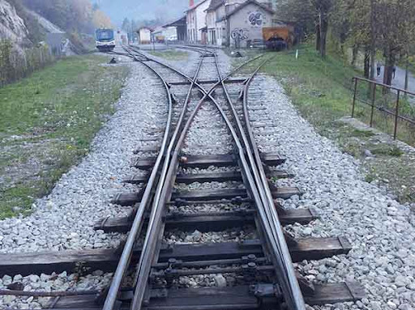

class: center, middle

# Modeling Data


```{r setup, message=FALSE, warning=FALSE, echo = FALSE}
library(tidyverse)
library(ggplot2)
library(palmerpenguins)
library(broom)
library(ggthemes)
library(knitr)
library(patchwork)
library(emmeans)


opts_chunk$set(fig.height=7, 
               fig.width = 10,
               fig.align = "center",
               comment=NA, 
               warning=FALSE, 
               echo = FALSE,
               message = FALSE,
               results="hide")

penguins <- na.omit(penguins)

options(htmltools.dir.version = FALSE)
theme_set(theme_classic(base_size=18))
```

```{r xaringan-themer, include=FALSE, warning=FALSE}
library(xaringanthemer)
style_mono_light(
  base_color = "#23395b",
  colors = c(
  red = "#f34213",
  purple = "#3e2f5b",
  orange = "#ff8811",
  green = "#136f63",
  white = "#FFFFFF"
  )
)
```

---
class: middle

# Up until now, we've just looked at data
<br>

.pull-left-wide[
```{r penguin_viz}
pen <- ggplot(penguins,
       aes(x = body_mass_g, y = flipper_length_mm, 
           color = species, shape = sex)) +
  geom_point(size = 2) +
  labs(x = "Body mass (g)\n", y = "Flipper length (mm)\n",
       color = "Species", shape = "Sex") +
  theme_classic(base_size=24)

pen
```
]

.pull-right-narrow[
- Is there really a linear relationship there?  
  
- Does that relationship vary by species?  
  
- Does that relationship vary by sex?  
  
- What else can I learn from this system?
]

---
# How do we move beyond squinting? Is there one line here?

```{r pen2}
pen +
  stat_smooth(method = "lm", aes(group=1),
              color = "black")
```

---
# Or three?

```{r pen3}
pen +
  stat_smooth(method = "lm", aes(group=species),
              color = "black")
```

---
# How Do Relationships Vary by Response Variable?


```{r pen4}
a <- pen +
  stat_smooth(method = "lm", aes(group=species),
              color = "black")

b<- ggplot(penguins,
       aes(x = body_mass_g, y = bill_depth_mm, 
           color = species, shape = sex)) +
  geom_point(size = 2) +
  labs(x = "Body mass (g)\n", y = "Bill Depth (mm)\n",
       color = "Species", shape = "Sex") +
  theme_classic(base_size=24) +
  stat_smooth(method = "lm", aes(group=species),
              color = "black")

a+b+ plot_layout(guides = "collect")& theme(legend.position = "bottom")
```


---
class: center, middle

# How do we learn about the world with data?

---

# Building an Inferential Machine: Data in Knowledge Out!
<br>


--
<br><br>
.center[No.... that's not quite right]

---

# Is Your Model a Golem?
#### (sensu McElreath)


--
<br>
We build a model of the world, give it instructions, and let it loose - trying not to burn down Prague.

---
background-image: url("Images/modeling/midnight_train_sharon_ann_bodenus.jpg")
color: white

# .white[On a Midnight Train to Inference]

---

# What are we doing when we model data?

<br><br>

1. Start with a question we want to answer 
  
--

2. Design a model of the part of the world we need to know about to answer the question  
  
--

3. Acquire data appropriate to build that model  

--

4. Chose an engine to fit the model  

--

5. Chose an inferential framework

--

6. Use that framework to ask the fit model questions about the world  

---
class: center, middle

# Start with a Question - What is/are Yours?

---
background-image:url("Images/modeling/train_blueprints_madcom_deviantart.png")
background-size: contain

# Design Your Train

---
# DAG - that's a good Train

```{r ggdag, fig.height = 6}
library(ggdag)
dagified <- dagify(cause ~ other,
                   effect ~ other + cause,
                   
                   exposure = "cause",
                   outcome = "effect")
tidy_dagitty(dagified) %>%
  mutate(x = c(0,1,1,2),
         y = c(1,2,2,1),
         xend = c(2,0,2,NA),
         yend = c(1,1,1,NA),
         circular = c(F,T,T,F)) %>%
  ggdag() +
  geom_dag_node(aes(color = circular), size = 34) +
  geom_dag_text(aes(label = name), color = "white", size = 8) +
  geom_dag_edges(size = 12, edge_color = "black") +
      theme_dag(base_size = 24) +
  scale_color_tableau(guide = "none")
```

--
.large[draw your system!]

---
background-image:url("Images/modeling/coastal_starlight.jpg")
background-size: contain

# Build Your Train with Data

---
# Choose an Engine
<br><br>
<!-- https://github.com/emilyriederer/xaringan_columns -->

![:col_header Ordinary Least Squares, Maximum Likelihood, Bayes]
![:col_row 
   ,
   ,
  

]
--
![:col_list 
  Minimizes distance between prediction and observed,
  
  Models distribution of data based on the model,
  
  Same - but incorporates prior information and gets wild
]

---
# Choose Your Inferential Track

  
![:col_header Hypothesis Testing, 
  Model Comparison, 
  Bayesian Model Implications
  ]
--
![:col_list 
  Deductive Inference,
  Predictive Inference,
  Inductive Inference
]
--
![:col_list 
  Uses probabilities of overlap with a point hypothesis,
  Uses tests of model performances on new data,
  Uses probability distributions of parameters and simulation
]


---
# Look Out the Window and Ask Questions!


---
# What is the Landscape Your Train is Taking You Through?


---
# What You Want to Avoid


---
# Or Worse, Problems That You Might Not Notice


---
class: center, middle

# What factors influence penguin bill depth?


---

# How do I think the system works?

```{r penguin_dag}

penguin_dag <- dagify(bill_depth ~ species + body_mass ,
                   body_mass ~ species)

ggdag(penguin_dag) +
  geom_dag_node(size = 34) +
  geom_dag_text(aes(label = name), color = "white", size = 5) +
  geom_dag_edges(edge_colour = "red") +
  theme_dag_gray()

```

---

# How do I think the system works?
<br>

$$Depth_{ij} \sim \mathcal{N}(\hat{depth}, \sigma^2)\\
\hat{depth}_i = \alpha_j + \beta * mass_{ij}$$


--

- Beak depth of individual i from species j ...

--

- is Normally distributed with some predicted depth with some error variance

--

- the predicted depth is a function of a species-specific intercept -  $\alpha_j$  - and a coefficient $\beta$ times the body mass

---

# Chose an Engine and fit that model....


```{r lm}
mod <- lm(bill_depth_mm ~ body_mass_g + species,
          data = penguins)
```

```{r get_model_outputs}

mod_glm <- glm(bill_depth_mm ~ body_mass_g + species,
          data = penguins)

mod_dat <- augment(mod,
                   se_fit = TRUE,
                   interval = c("confidence"))
```

---

# What OLS is Doing

```{r ols}
ggplot(mod_dat,
       aes(x = body_mass_g, y = bill_depth_mm, group = species)) +
    geom_segment(aes(xend = body_mass_g, 
                   y=.fitted,
                   yend = bill_depth_mm),
               color ="red") +
  geom_point() +
  geom_point(aes(y=.fitted, group = species),
             color = "grey", size = 0.5) +
  geom_line(aes(y=.fitted, group = species)) 

```

---

# If we had done MLE...

```{r mle}
library(profileModel)

prof <- profileModel(mod_glm,
                     objective = "ordinaryDeviance")

plot(prof)
```

---

# If we had done Bayes...

```{r bayes, cache = TRUE}
library(brms)
library(tidybayes)
mod_bayes <- brm(bill_depth_mm ~ body_mass_g + species,
          data = penguins,
          file = "penguins_bayes",
          file_refit = "on_change")

plot(mod_bayes)

```

---

# Make sure we our train doesn't blow up...

A comparison of the distribution of observed bill depths versus those predicted by our model - one of *many* diagnostics

```{r assumption, fig.height=6}

mod_dat %>%
  select(bill_depth_mm, .fitted) %>%
  pivot_longer(cols = everything()) %>%
  ggplot(aes(x = value, color = name)) +
  geom_density(size = 1.5) +
  labs(color = "") +
  scale_color_brewer(palette = "Dark2")
```

---

# So many ways our train could have blown up...

```{r performance}
performance::check_model(mod)
```

---

# Inference 

  

--

Oh, let's go with hypothesis testing...

---

# Our first journey: what do things look like out the window?

```{r model_viz}
modviz <- ggplot(data = mod_dat,
       aes(x = body_mass_g, color = species)) +
  geom_point(aes(y = bill_depth_mm)) +
  geom_line(aes(y = .fitted), size = 1.5) 

modviz
```


---

# Coming 'round the bend - do species or body mass matter?

Let's look at the ratio of variation explained by each predictor versus noise, and ask, what's the probability of seeing that ratio or a more extreme ratio if that predictor actually did not affect bill depth. This is a *p-value*.

--

```{r anova}
car::Anova(mod) %>%
  tidy %>%
  kable("html", digits = 2) %>%
  kableExtra::kable_styling(bootstrap_options = c("striped", "bordered"))
```

---

# Passing the next hill - how precise are our coefficient estimates?

```{r plot_confidence, fig.height = 6}
modviz +
  geom_ribbon(aes(ymin = .lower, ymax = .upper, group = species),
              fill = "grey", alpha = 0.5, color = NA)
```

--

We can see that there is still scatter - but can estimate that our model explains `r round(summary(mod)$r.squared,2)*100`% of the variation in bill depth

---
# One last check for the road - are species different from one another, if we held body mass constant?

```{r posthoc, fig.height = 5}
emmeans(mod, ~species) %>%
  contrast("pairwise") %>%
  plot() +
  geom_vline(xintercept = 0, lty = 2)
```
--

Note, I'm not calculating p-values, but looking at the precision of our estimates of differences to see if they overlap 0. This is still hypothesis testing - deductive inference.

---

# What did we learn?

- Species and body mass matter for bill depth

- We have been able to estimate this relationship fairly well for the data we have  

- Body mass leads to deeper bills  

- If we lined up a penguins of the same body mass, Gentoo penguins have less deep bills

- At the same mass, Adelie and Chinstrap penguins have the same bill depth