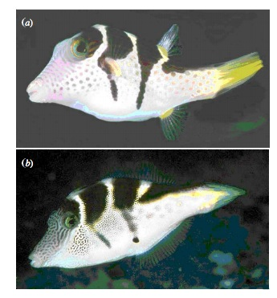
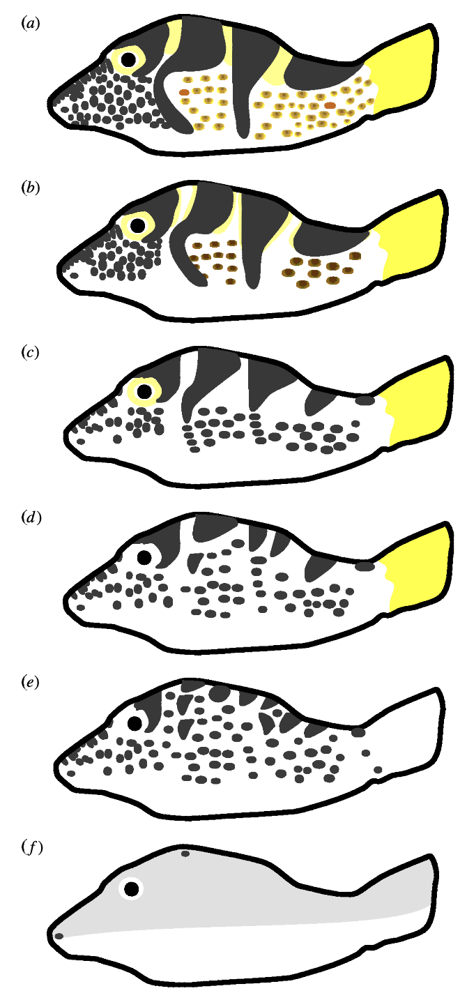
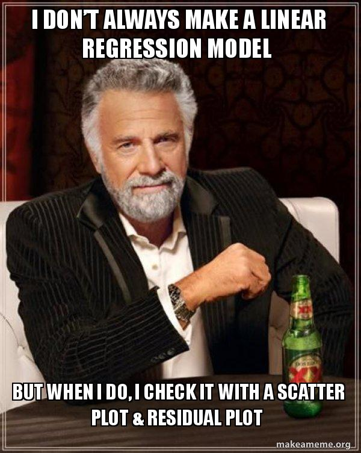
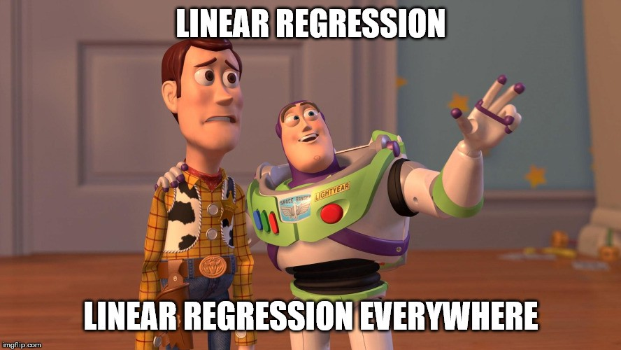

class: center, middle

# Single Predictor Models

```{r setup, message=FALSE, warning=FALSE, echo = FALSE}
library(tidyverse)
library(ggplot2)
library(broom)
library(ggthemes)
library(knitr)
library(patchwork)
library(emmeans)
library(brms)


opts_chunk$set(fig.height=7, 
               fig.width = 10,
               fig.align = "center",
               comment=NA, 
               warning=FALSE, 
               echo = FALSE,
               message = FALSE)


options(htmltools.dir.version = FALSE)
theme_set(theme_classic(base_size=22))
```

```{r xaringan-themer, include=FALSE, warning=FALSE}
library(xaringanthemer)
style_mono_light(
  base_color = "#23395b",
  colors = c(
  red = "#f34213",
  purple = "#3e2f5b",
  orange = "#ff8811",
  green = "#136f63",
  white = "#FFFFFF"
  )
)
```


---

# What are we doing when we model data?

<br><br>

1. Start with a question we want to answer 

2. Design a model of the part of the world we need to know about to answer the question  

3. Acquire data appropriate to build that model  

4. Chose an engine to fit the model  

5. Chose an inferential framework

6. Use that framework to ask the fit model questions about the world  


---
# Many models have one predictor


---

class: middle

# Many models have one predictor


```{r dag, fig.height = 4, fig.width=9}
library(ggdag)
dagified <- dagify(response ~ predictor + error,
                   labels = c("response" = "respose",
                              "predictor" = "predictor",
                              "error" = "error"),
                  exposure = "predictor",
                  outcome = "response",
                  latent = "error")

ggdag_equivalent_dags(dagified, text = FALSE, 
            use_labels = "label", 
            shadow = TRUE) + 
  theme_dag_gray() +
  scale_color_viridis_d(guide = "none") +
  guides(shape = "none", color = "none")

# dagify(response ~ predictor + error) %>%
# tidy_dagitty() %>%
#   mutate(x = c(2,0,1),
#          y = c(1.5,1,1),
#          xend = c(1.1,0.8,NA),
#          yend = c(1,1,NA),
#          circular = c(T,F,F)) %>%
#   ggdag() +
#   geom_dag_node(aes(color = circular), size = 54) +
#   geom_dag_text(aes(label = name), color = "white", size = 8) +
#   geom_dag_edges(edge_width = 2, angle=1,
#                  edge_color = "black") +
#       theme_dag_gray(base_size = 20) +
#   scale_color_tableau(guide = "none") +
#   scale_y_continuous(limits = c(0.5,2))
```


---
# Model in Equation Form

.large[

$$y_i \sim \mathcal{N}(\hat{y_i}, \sigma^2)\\
\hat{y_i} = \beta_0 + \beta_1  x_i$$

]

--

<br><br>

- Response $y_i$ is normally distributed around a fitted value with some residual error.  

- The fitted value is determined by an intercept and a slope multiplied by a predictor $x_i$.  

- That's it.

---
background-color:black
class:middle


---
# One Predictor Models
1. Linear Regression  
      - Did our model set its world on fire?  
      - Does our predictor matter?  
      - Describing associations between variables
      - What confidence do we have in our fit?  
      - How good are we at explaining our response

2. Comparing two means  
     - It's just linear regression with two values for X  
     - Assessing the difference between two estimated parameters

3. Comparing many means  
     - It's just a bunch of two-value linear regressions again  
     - Making pairwise comparisons  

---

# Batesian Mimicry with Pufferfish

```{r pufferload}
puffer <- read.csv("./data/16q11PufferfishMimicry Caley & Schluter 2003.csv") %>%
  mutate(resemblance = 5-resemblance)
```

.pull-left[
- Pufferfish are toxic/harmful to predators  
<br>
- Batesian mimics gain protection from predation - why?
<br><br>
- Evolved response to appearance?
<br><br>
- Researchers tested with mimics varying in toxic pufferfish resemblance
]

.pull-right[

]


---
# Scale of Dissimilarity



.pull-left[ .small[Carey and Schluter 2003] ]

---

# The Data
```{r puffershow}
pufferplot <- ggplot(puffer, 
                     mapping=aes(x=resemblance, y=predators)) +
  ylab("Predator Approaches per Trial") + 
  xlab("Resemblance to Toxic Pufferfish\n1 = Low, 4 = High")  +
  geom_point(size = 3) 

pufferplot
```

---

# Our Model
.large[

$$visits_i \sim \mathcal{N}(\hat{visits_i}, \sigma^2)\\
\hat{visits_i} = \beta_0 + \beta_1  resemblance_i$$

]

```{r dagmod, fig.height = 5}

set.seed(2021)
dagify(predators ~ resemblance + error,
                   labels = c("predators" = "predators",
                              "resemblance" = "resemblance",
                              "error" = "error"),
                  exposure = "resemblance",
                  outcome = "predators",
                  latent = "error") %>%
ggdag_classic() + 
  theme_dag_gray() +
  scale_color_viridis_d(guide = "none") +
  guides(shape = "none", color = "none")


# dagify(visits ~ resemblance + error) %>%
# tidy_dagitty() %>%
#   mutate(x = c(2,0,1),
#          y = c(1.5,1,1),
#          xend = c(1.1,0.8,NA),
#          yend = c(1,1,NA),
#          circular = c(T,F,F)) %>%
#   ggdag() +
#   geom_dag_node(aes(color = circular, shape = circular), size = 64) +
#   geom_dag_text(aes(label = name), color = "white", size = 8) +
#   geom_dag_edges(edge_width = 2, angle=1,
#                  edge_color = "black") +
#       theme_dag_gray(base_size = 20) +
#   scale_color_tableau(guide = "none") +
#   scale_shape_manual(guide = "none", values = c(15,16)) +
#   scale_y_continuous(limits = c(0.5,2)) +
#   scale_x_continuous(limits = c(-0.5, 2.5))
```
---

# Fit with Our Engine: Ordinary Least Squares

### Simple model, simple solution!  

<br><br>

.large[
```{r mod_lm, echo = TRUE}
mod <- lm(predators ~ resemblance, data = puffer)
```

]

---

# Engine Makes No Difference Here

```{r fits, cache = TRUE, resuts = "hide"}
mod_glm <- glm(predators ~ resemblance, data = puffer)
mod_brm <- brm(predators ~ resemblance, data = puffer, file="puffer")
```

```{r engine_tab, results='asis'}
bind_rows(
  tibble(engine = rep("OLS", 2), tidy(mod))[,1:4],
  tibble(engine = rep("ML", 2), tidy(mod_glm))[,1:4],
  tibble(engine = rep("Bayes", 2), 
         as_tibble(fixef(mod_brm)[,1:2])) %>% 
    rename(estimate = Estimate, std.error = Est.Error) %>%
    mutate(term = c("(Intercept)", "resemblance"))
) %>% knitr::kable(digits = 2)
```

---
background-color:black
class:middle



---

# Does Your Model Match Your Data?

```{r densplot}
mod_data <- augment(mod)

mod_data %>%
  select(predators, .fitted) %>%
  pivot_longer(everything()) %>%
  ggplot(aes(x = value, color = name)) +
  geom_density(size = 1.3) +
  scale_color_excel_new()

```


---

# Are There Weird Patterns in Your Residuals?

```{r}
performance::check_model(mod, check = c("linearity", "normality"))
```

---

# What To Do If You've Caused a Fire

- Lay down and cry

--

- Change your model to something more interesting
     - This includes simple changes like log or logit transforming

--

- Recognize that your coefficient estimates are still correct, you just cannot do any inferential *testing* or talk about *error*

---

# Did Our Predictor Matter?

- F = Variability due to Slope & Intercept / Variability due to Error

--

- We ask, what is the probability we obtain an F values like the one we see or an even bigger one if our predictor didn't matter given how much data we have?

--

- This is called a **p-value**

```{r infer_badly, fig.height = 4}
tibble(x = seq(0,10,length.out=500),
       f = df(x, 4, 18), ymin=rep(0,500)) %>%
  ggplot(aes(x,f)) +
  geom_line() +
  geom_ribbon(data = . %>% filter(x>2.5),
              aes(ymax = f, ymin = ymin), fill = "blue")
```

---

# Did Our Predictor Matter?
<br><br>
```{r lm_f}
anova(mod) %>%
  tidy()%>% 
  knitr::kable(digits = 2) %>%
  kableExtra::kable_styling("striped")
```

--

- p is so small it rounds to 0  

--

- the probability of our result or a more extreme result given a null hypothesis that our result isn't distinguishable from noise is 0

--

- larger p-values mean a greater chance that we cannot reject this null

--

- what % chance are you comfortable with?

---

# What is the Association Between Predictor and Response?

```{r coeftab}
tidy(mod)[,1:3]%>% 
  knitr::kable(digits = 2) %>%
  kableExtra::kable_styling("striped")
```

- **Intercept:** If resemblance = 0, 16.87 predators will approach on average.

--

- **Slope:** A 1 unit increase in resemblance is associated with a decrease in ~3 predator visits

--

- The SE gives an estimate of the precision of our slope...

---

# How Precise Are Our Estimates?
### We can see by simulating new lines from our coefficients

```{r}
#devtools::install_github("jebyrnes/sinterval")
# library(sinterval)
# sdata <- sinterval::add_fitted_sims(mod_data, mod)
sim_coefs <- arm::sim(mod)@coef %>% as_tibble
pufferplot +
  geom_abline(data = sim_coefs, 
              aes(slope = resemblance, intercept = `(Intercept)`),
              color = "grey", alpha = 0.3) +
  stat_smooth(method = "lm", fill = NA)

```

---

# How Precise Are Our Estimates?
### We can see by with a 95% confidence interval of our estimate

```{r}
#devtools::install_github("jebyrnes/sinterval")
# library(sinterval)
# sdata <- sinterval::add_fitted_sims(mod_data, mod)
pufferplot +
  stat_smooth(method = "lm")

```
---

# How Strong is the Association Between Our Generative Model and Observed Data?

$$R^2 = 1 - \frac{Residual \; Variation}{Total \; Variation \; in \; the \; Data}$$
```{r resplot, fig.height = 5}
pufferplot +
  stat_smooth(method = "lm", fill = NA) +
  geom_segment(data = mod_data, aes(xend = resemblance,
                                    yend = .fitted),
               color = "red")
```


---
# One Predictor Models
1. Linear Regression  
      - Did our model set its world on fire?  
      - Does our predictor matter?  
      - Describing associations between variables
      - What confidence do we have in our fit?  
      - How good are we at explaining our response

2. .red[ Comparing two means]  
     - It's just linear regression with two values for X  

3. Comparing many means  
     - It's just a bunch of two-value linear regressions again  
     - Making pairwise comparisons  
     
---

# Comparing High and Low Similarity

```{r two_trts}
puffer_t <- puffer %>%
  filter(resemblance %in% c(1,4)) %>%
  mutate(resemblance_trt = ifelse(resemblance==4, "Similar", "Not Similar"),
         resemblance_dummy = ifelse(resemblance==4, 1,0))

ggplot(puffer_t,
       aes(x = resemblance_trt, y = predators)) +
  geom_boxplot() +
  ylab("Predator Approaches per Trial") + 
  xlab("")  +
  geom_point(size = 3, position=position_jitter(width=0.2, height=0)) 
```

---
class:middle
background-color: black


---

# Our Model Is Unchanged
.large[

$$visits_i \sim \mathcal{N}(\hat{visits_i}, \sigma^2)\\
\hat{visits_i} = \beta_0 + \beta_1  resemblance_i$$

]

```{r dagmod, fig.height = 5}
```
---

# Comparing Means is Just a Line with a 0 and 1 as X

```{r zero_one}
ggplot(puffer_t,
       aes(x = resemblance_dummy, y = predators)) +
  ylab("Predator Approaches per Trial") + 
  xlab("Is Similar to a Pufferfish?")  +
  geom_point(size = 3) +
  stat_smooth(method = "lm", color = "red", size = 1.3) +
  scale_x_continuous(breaks = c(0,0.5,1))
```

---

# Fit with OLS

- `lm` recodes treatment as 0/1 - a dummy variable!

.large[

```{r dummy, echo = TRUE}
mod_t <- lm(predators ~ resemblance_trt, data = puffer_t)
```

]

---

# Does Your Model Match Your Data?

```{r densplot_t}
mod_data_t <- augment(mod_t)

mod_data_t %>%
  select(predators, .fitted) %>%
  pivot_longer(everything()) %>%
  ggplot(aes(x = value, color = name)) +
  geom_density(size = 1.3) +
  scale_color_excel_new()

```
---

# Are There Weird Patterns in Your Residuals?

```{r}
performance::check_model(mod_t, check = c("linearity", "normality"))
```

---

# Did Our Predictor Matter?
### F-Test!

```{r f_t}
anova(mod_t) %>%
  tidy()%>% 
  knitr::kable(digits = 2) %>%
  kableExtra::kable_styling("striped")
```

--

Still basically no chance of observing our data or more extreme data

---

# Are the Groups *REALLY* Different?

- If we subtract one group mean from the other, the **null hypothesis** is that the answer will be 0

--

- It should fall in a distribution, though, given that this is a sample.

--

- This distribution was discovered by a former chief brewer at Guiness! He published under the name Student and called this the t distribution.

---

# Are the Groups *REALLY* Different?

```{r emmeans_t, fig.height = 6}
em_t <- emmeans(mod_t, ~resemblance_trt)

cont_t <- contrast(em_t, "pairwise")

tidy(cont_t) %>%
  select(-term, -null.value) %>%
  kable(digits = 2) %>% kableExtra::kable_styling("striped")

plot(cont_t) +
  geom_vline(xintercept = 0, lty = 2)
```

---

# What do our Estimates Look Like?

```{r}
ggplot(puffer_t,
       aes(x = resemblance_trt, y = predators)) +
  ylab("Predator Approaches per Trial") + 
  xlab("Is Similar to a Pufferfish?")  +
  geom_point(size = 3, color = "grey") +
  stat_summary(color = "red", fun.data = "mean_cl_boot")
```

---
# One Predictor Models
1. Linear Regression  
      - Did our model set its world on fire?  
      - Does our predictor matter?  
      - Describing associations between variables
      - What confidence do we have in our fit?  
      - How good are we at explaining our response

2. Comparing two means  
     - It's just linear regression with two values for X  

3. .red[ Comparing many means]  
     - It's just a bunch of two-value linear regressions again  
     - Making pairwise comparisons  
     
---

# Categorical Instead of Continuous Predictors


```{r puffer_categories}
puffercat<- ggplot(puffer, 
                     mapping=aes(x=as.character(resemblance), y=predators)) +
  ylab("Predator Approaches per Trial") + 
  xlab("Resemblance to Toxic Pufferfish\n1 = Low, 4 = High")  +
  geom_boxplot() +
  geom_point(size = 3) 

puffercat
```

---
class:middle
background-color: black



---

# Our Model Changes...slightly....
.large[

$$visits_{ij} \sim \mathcal{N}(\hat{visits_{ij}}, \sigma^2)\\
\hat{visits_{ij}} = \beta_0 + \sum\beta_j  resemblance_{ij}$$

]

--

<Br><br>
- individual i in treatment j  

--

- $resemblance_{ij}$ is now 1 if you are in treatment j, otherwise 0

--

- $\beta_j$ can be deviation from a grant mean, $\beta_0$

---
# But Conceptually It Is the Same

```{r dagmod, fig.height = 4}
```

---

# It's just a bunch of 0's and 1s!

```{r}
puffer <- puffer %>% 
  mutate(resemblance_c = as.character(resemblance))

puffer_aov_data <- bind_cols(puffer,
                             model.matrix(predators ~ resemblance_c,
                                          data = puffer) %>% as_tibble)

a <- ggplot(puffer_aov_data,
            aes(x = resemblance_c4, y = predators)) +
    ylab("Predator Approaches per Trial") + 
  xlab("In Treatment 4?")  +
  geom_point(size = 3) +
  stat_smooth(method = "lm", color = "red")

b <- ggplot(puffer_aov_data,
            aes(x = resemblance_c3, y = predators)) +
    ylab("Predator Approaches per Trial") + 
  xlab("In Treatment 3?")  +
  geom_point(size = 3) +
  stat_smooth(method = "lm", color = "red")

a+b 
```

---

# What You Are Ultimately Fitting

```{r aov, echo = TRUE}
mod_aov <- lm(predators ~ resemblance_c, data = puffer)
```

```{r cat, fig.height = 7}
ggplot(puffer_aov_data,
            aes(x = resemblance_c, y = predators)) +
    ylab("Predator Approaches per Trial") + 
  xlab("Resemblance to Toxic Pufferfish\n1 = Low, 4 = High")  +
  geom_point(size = 3, color = "grey") +
  stat_summary(color = "black", fun.data = mean_cl_boot) +
  stat_summary(color = "black", fun = mean, geom = "line",
               group = 1, lwd = 1.5)

```

---

# Still Have to Make Sure We Have Started No Fires

```{r aov_perf}
performance::check_model(mod_aov, check = c("linearity", "normality"))
```

---

# Does Our Predictor Matter?
## This is often called an Analysis of Variance or ANOVA
### It's still just an F test

<br>
```{r anova}
anova(mod_aov) %>%
  tidy()%>% 
  knitr::kable(digits = 2) %>%
  kableExtra::kable_styling("striped")
```

--

Compare to regression - note difference in F:
```{r lm_f}
```

---

# What do our Estimates Look Like?
```{r cat}
```
---

# Which Groups *REALLY* Different?  Have some T...
```{r tukey, fig.height = 6}
em_aov <- emmeans(mod_aov, ~resemblance_c)
em_cont <- contrast(em_aov, "tukey")
plot(em_cont)
```

--

Was this model a good way to ask the question?

---

# One Predictor and Go!
.large[

$$y_i \sim \mathcal{N}(\hat{y_i}, \sigma^2)\\
\hat{y_i} = \beta_0 + \beta_1  x$$

]

- There are many ways to use this model  

--

- We can fit lines, compare two or even more means

--

- But it's just a model. Your questions have to guide how you use it.

--

- For communication with your audience, they don't need the nitty-gritty details - but they need to learn what the model can tell them that is new