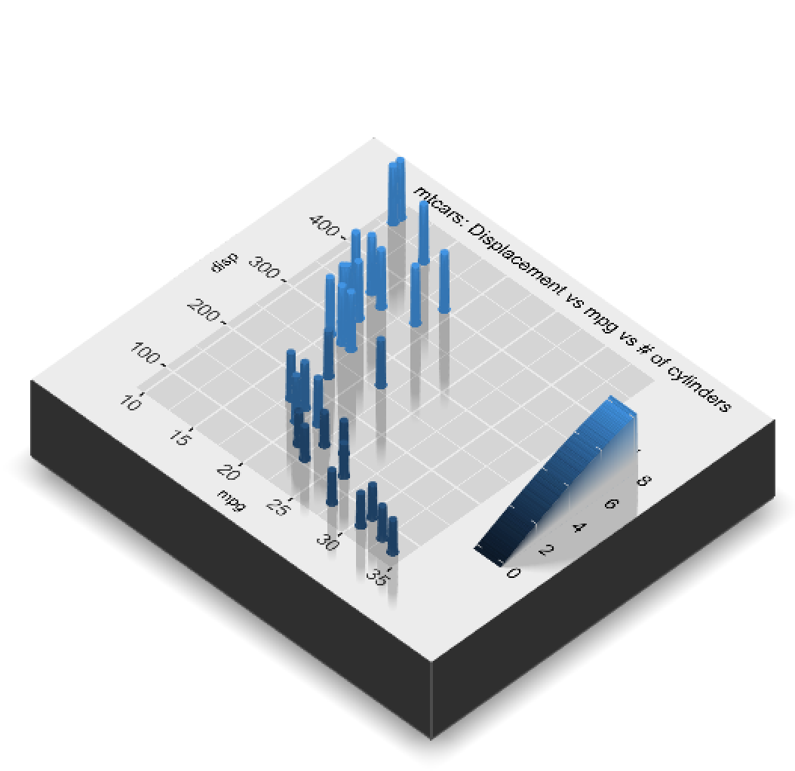

```{r setup, include=FALSE}
library(tufte)
library(waffle)
library(hrbrthemes)
library(dplyr)
hrbrthemes::import_roboto_condensed()
# invalidate cache when the tufte version changes
knitr::opts_chunk$set(tidy = FALSE, echo = FALSE, warning=FALSE, message=FALSE, cache.extra = packageVersion('tufte'))#,
#                       fig.width=3.5, fig.height=3.5)
options(htmltools.dir.version = FALSE)
```

# Introduction

In the wild and wolly world of R, there are many packages out there. Some of them are on the Comprehensive R Archive Network^[See [CRAN](https://cran.r-project.org/)]. Many can be found on [Github](http://github.com/)^[A site for sharing code and using `git` as version control software. If you're interested, see [Happy with Git](https://happygitwithr.com/) for more and talk to me. Extra credit awaits...] and installed with the [devtools](https://devtools.r-lib.org/) package^[instead of `install.packages` you use `devtools::install_github('username/pkgname')`].  

Throughout the semester, we've been refering you to [R Cheat Sheets](https://rstudio.com/resources/cheatsheets/) for everything from [working with strings](https://github.com/rstudio/cheatsheets/raw/master/strings.pdf) to [ggplot2](https://github.com/rstudio/cheatsheets/raw/master/data-visualization-2.1.pdf) and more.  These cheat sheets are invaluable as learning tools. Creating a cheat sheet is also an amazing way to familiarize yourself with a new package, and really solidify your knowledge of the R ecosystem.  

So, for your midterm, I'd like you to create a cheat sheet for the package of your choice. It can be a simple package, or a complex package, or anything in between. Below, I'll detail the steps of the process, as well as provide a list of some packages that might be enjoyable to use for this assignment - although the choice is ultimately up to you!

# Due Date 
March 24, 2023  

# Simple Extra Credit
Put your cheatsheet up on Github!If you're interested, see [Happy with Git](https://happygitwithr.com/) for more and/or talk to me.  

# Past Example Cheatsheets

[vegan](https://github.com/rstudio/cheatsheets/raw/master/vegan.pdf) - by Bruna Silva in 2020, now on Rstudio's website!  
[auk](https://github.com/CornellLabofOrnithology/auk/blob/master/cheatsheet/auk-cheatsheet.pdf) - by Mickayla Johnson in 2020  
[waffle](https://twitter.com/StephenSmiddy1/status/1243590545458552832/photo/1) - by Stephen Smiddy in 2020  
[slackr](https://github.com/dmvillarreal/cheatsheets/blob/master/slackr_cheat_sheet.pdf) - from Daniel Villareal  
  
# Steps
1. First, look at existing [R Cheat Sheets](https://rstudio.com/resources/cheatsheets/). I will give you a homework question asking you to identify what you do and do not find useful about the examples here shortly.

2. Second, read up on [how to create an R Cheat Sheet](https://github.com/rstudio/cheatsheets/blob/main/.github/CONTRIBUTING.md). Download the template and read it over CAREFULLY.

3. Third, select a package. See the section below on possible packages and/or where to find other packages. Once you have selected a package, sign up [here](https://docs.google.com/spreadsheets/d/1nEyWhubzjY3x7vzezP_mVmaa59b9RMpdivzH8d4EkwI/edit?usp=sharing) so only one person gets one package!

4. Play with the package. A lot. I will have an upcoming homework question about this, asking what are the most interesting things that the package does, what are the most useful things that it does, what elements of it you think most people would use the most frequently, and how would you organize this information.  
  
5. Make a sketch of your cheatsheet. Be as detailed as you can. This will also be a future homework question!  

6. Finally, make the cheat sheet. Read the [template](https://github.com/rstudio/cheatsheets/blob/main/.github/CONTRIBUTING.md) carefully, as there many wonderful tips for how to make an effective cheatsheet.

# Grading
The breakdown of your grade for this assignment will be as follows:  

- 50% Utility. Can I execute things from this package using your cheat sheet?  
- 25% Completeness. How thoroughly did you explore the package? Is it just one or two things, or is this really a guide to the whole thing.
- 15% Communication: Is it aesthetically pleasing (i.e. did you do a good job communicating the package to a new user)?  
- 10% - Accessibility: Spelling, grammer, etc. Yes. They matter. It's communication.  
- Extra credit - 10% - going above and beyond and covering a topic area with multiple packages instead of a single package. Talk to Prof. Byrnes for more on this.  
- Extra credit - 10% - get it on Rstudio's contributed cheat sheet website
- Extra credit - 10% - get folk commenting on it on [#rstats twitter](https://twitter.com/search?q=%23rstats&src=typed_query)!

# Things NOT to do
- Do not write a long word document explaining the package  
- Do not make a bunch of slides rather than use the template for a cheat sheet  

# Finding a Package
While we provide a few packages below, you're also more than welcome to search for ones you might find interesting. There are a number of places to look. Your package can be from CRAN. It might be from a [CRAN Task View](https://cran.r-project.org/web/views/). You might find it on [awesome-r.com](https://awesome-r.com/). It could be a package featured as a [Top 40 new package at Rviews](https://www.google.com/search?q=top+40&q=site%3Ahttps%3A%2F%2Frviews.rstudio.com). Or take a look at the New and Updated packages section of [rweekly](https://rweekly.org/#NewPackages) (note - I read this daily!). Many data oriented packages can be found at [ROpenGov](https://ropengov.github.io/projects/) or for health data, [rOpenHealth](https://github.com/rOpenHealth). I'm also a big fan of [ROpenSci](https://ropensci.org/packages/) for many ecologically focused packages. Also, on our [data sets page](https://biol355.github.io/datasets.html) there are a variety of R packages that provide access to data. Those are great targets as well!  

# Some package suggestions

By all means, don't chose something from the list below if you don't want to! But there are some packages which might be good to think about if your imagination is flagging. I'll also provide a bit of an example of what they can do.

## gghighlight

[gghighlight](https://yutannihilation.github.io/gghighlight/) allows you to easily highlight specific lines and points within a ggplot.

```{r gghighlight, fig.margin = FALSE, fig.cap="An example of a new geom from gghighlight"}
#from readme
library(gghighlight)
library(ggplot2)
set.seed(2)
d <- purrr::map_dfr(
  letters,
  ~ data.frame(
      idx = 1:400,
      value = cumsum(runif(400, -1, 1)),
      type = .,
      flag = sample(c(TRUE, FALSE), size = 400, replace = TRUE),
      stringsAsFactors = FALSE
    )
)

ggplot(d) +
  geom_line(aes(idx, value, colour = type)) +
  gghighlight(max(value) > 19)+ theme_minimal()+ facet_wrap(~ type)

```


## ggforce

The [ggforce](https://ggforce.data-imaginist.com/) package that contains a number of additional geoms and stats for `ggplot2` giving added functionality and really fun plots.

```{r ggforce, fig.margin = FALSE, fig.cap="An example of a new geom from ggforce"}
library(ggforce)
data <- reshape2::melt(Titanic)
data <- gather_set_data(data, 1:4)

ggplot(data, aes(x, id = id, split = y, value = value)) +
  geom_parallel_sets(aes(fill = Sex), alpha = 0.3, axis.width = 0.1) +
  geom_parallel_sets_axes(axis.width = 0.1) +
  geom_parallel_sets_labels(colour = 'white')
```

## patchwork

[patchwork](https://patchwork.data-imaginist.com/) is a truly amazing package that allows you to combine multiple ggplots into multipaneled figures. I'll admit, this is one of the workhorse packages I use almost every day. But - it doesn't have a cheatsheet! Can you write one?

```{r patchwork, fig.margin = FALSE, fig.cap="An example of multipaneled patchwork plots"}
library(patchwork)
p1 <- ggplot(mtcars) + geom_point(aes(mpg, disp))
p2 <- ggplot(mtcars) + geom_boxplot(aes(gear, disp, group = gear))
p3 <- ggplot(mtcars) + geom_smooth(aes(disp, qsec))
p4 <- ggplot(mtcars) + geom_bar(aes(carb))

(p1 | p2 | p3) /
      p4

```

## vroom

Reading comma separated files and the like seems fast to you now - but that's only because we've been reading files with kilobytes of data in them at most. What about when you get to REAL big data - files with gigabytes or more of data in them? That's where [vroom](https://vroom.r-lib.org/) comes in. It can read over 1GB of data per second! But with great power, comes great responsibility in terms of how you structure loading files - and there are ways to load MANY files with vroom as well. So, try writing a cheat sheet on large file(s) handling with [vroom](https://vroom.r-lib.org/)!

```{r vroom, eval=FALSE, echo = TRUE}
vroom::vroom("mtcars.tsv",
  col_types = list(cyl = "i", gear = "f",hp = "i", disp = "_",
                   drat = "_", vs = "l", am = "l", carb = "i")
)
#> # A tibble: 32 x 10
#>   model           mpg   cyl    hp    wt  qsec vs    am    gear   carb
#>   <chr>         <dbl> <int> <int> <dbl> <dbl> <lgl> <lgl> <fct> <int>
#> 1 Mazda RX4      21       6   110  2.62  16.5 FALSE TRUE  4         4
#> 2 Mazda RX4 Wag  21       6   110  2.88  17.0 FALSE TRUE  4         4
#> 3 Datsun 710     22.8     4    93  2.32  18.6 TRUE  TRUE  4         1
#> # … with 29 more rows
```

## snakecase
[snakecase](https://tazinho.github.io/snakecase/) is an all in one converter of complicated strings to a number of more standardized formats - snakecase, camelcase, and others. In addition to specific parsers, there's also a general parser, to come up with your own conversion case, and it handles transliterrating other languages on the fly.

```{r snake, echo = TRUE, fig.fullwidth=TRUE}
library(snakecase)

string <- c("lowerCamelCase") 

to_any_case(string)

#from German!
to_any_case("Doppelgänger", 
            transliterations = "german", 
            case = "upper_camel")
```

## scatterD3
Do you love awesome interactive web plots? Then [scatterD3](https://juba.github.io/scatterD3/) is for you!

```{r scatterD3, fig.cap = "Play with this scatterD3 plot!"}
library(scatterD3)
mtcars$names <- rownames(mtcars)
scatterD3(data = mtcars, x = wt, y = mpg, lab = names,
          col_var = cyl, symbol_var = am,
          xlab = "Weight", ylab = "Mpg", col_lab = "Cylinders",
          point_size = 200, point_opacity = 0.5,
          symbol_lab = "Manual transmission")
```

<!--
## waffle
Pie charts are so yesterday. Make a [waffle](https://github.com/hrbrmstr/waffle) chart instead!

```{r waffle, fig.cap = "Combining waffles and bar charts FOR SCIENCE!", fig.fullwidth=TRUE}
library(waffle)
library(hrbrthemes)
library(dplyr)
hrbrthemes::import_roboto_condensed()

storms %>% 
  filter(year >= 2010) %>% 
  count(year, status) -> storms_df

ggplot(storms_df, aes(fill = status, values = n)) +
  geom_waffle(color = "white", size = .25, n_rows = 10, flip = TRUE) +
  facet_wrap(~year, nrow = 1, strip.position = "bottom") +
  scale_x_discrete() + 
  scale_y_continuous(labels = function(x) x * 10, # make this multiplyer the same as n_rows
                     expand = c(0,0)) +
  ggthemes::scale_fill_tableau(name=NULL) +
  coord_equal() +
  labs(
    title = "Faceted Waffle Bar Chart",
    subtitle = "{dplyr} storms data",
    x = "Year",
    y = "Count"
  ) +
  theme_minimal(base_family = "Roboto Condensed") +
  theme(panel.grid = element_blank(), axis.ticks.y = element_line()) +
  guides(fill = guide_legend(reverse = TRUE))

```
-->

## visdat
We've used [visdat](https://docs.ropensci.org/visdat/) for basically one function, but there's so so soooo much more! Build a cheat sheet to help folk explore their data!

```{r visdat, fig.caption = "Using visdat to see which values are greater than or equal to 25."}
library(visdat)
vis_expect(airquality, ~.x >= 25)
```

## skimr
As with `visdat`, we've used [skimr](https://docs.ropensci.org/skimr/) for one function only, but, again, so much more! 

```{r skimr}
library(skimr)

faithful %>%
  skim()

```

## Extra Credit: data validation
Combine the `skimr` and `visdat` packages along with any others you find that are useful to create a comprehensive data validation cheat sheet for when you first load a new data set. This is a powerful beast, and is worth up to 25% extra credit.

## worms 
Taxonomy is hard. [worms](https://docs.ropensci.org/worrms/) makes it easy. Names change. We often want a lot of different information from a taxonomy. One place that is standardized to all marine species is the [World Register of Marine Species](https://www.marinespecies.org/).

```{r worms, cache=TRUE, fig.fullwidth=TRUE}
library(worrms)
l <- wm_records_taxamatch(name = 'Laminariales') 
r <- purrr::map_df(seq(1,401, 50),~ wm_records_rank(rank_id = 220, id = l[[1]]$AphiaID[1], offset = .x))

#the plot
r %>% 
  filter(status=="accepted") %>%
  group_by(family, genus) %>% 
  count() %>%
  ggplot(aes(x = family, y = n, fill = genus)) +
  geom_col() +
  ggthemes::theme_tufte(base_size=14) +
  xlab("") + ylab("") +
  ggtitle("number of species of kelps per family and genera") +
  scale_fill_viridis_d(option = "B", guide = "none")
```

## rnaturalearth
[rnaturalearth](https://docs.ropensci.org/rnaturalearth/) provides an interface to the Natural Earth project - a collection of vector and raster files to make amazing maps.

```{r rnaturalearth, fig.cap = "Lakes and rivers of the US", message=FALSE, warning=FALSE, cache=TRUE}
library(rnaturalearth)

# lakes
lakes110 <- ne_download(scale = 50, type = 'lakes', category = 'physical', returnclass="sf")

# rivers
rivers110 <- ne_download(scale = 50, type = 'rivers_lake_centerlines', category = 'physical', returnclass="sf")

ggplot(data = ne_countries(returnclass="sf")) +
  geom_sf() +
  geom_sf(data = lakes110, fill = "blue", color = "blue") +
  geom_sf(data = rivers110, fill = "blue", color = "blue") +
  theme_minimal()
```


## rayshader
[rayshadr](https://www.rayshader.com/) allows you to make all sorts of hauntingly beautiful photo-realistic 3D plots - maps, ggplots, and more!

```{r rayshadr, cache=TRUE}
# library(rayshader)
# 
# mtcars_gg = ggplot(mtcars) + 
#   geom_point(aes(x=mpg,color=cyl,y=disp),size=2) +
#   scale_color_continuous(limits=c(0,8)) +
#   ggtitle("mtcars: Displacement vs mpg vs # of cylinders") +
#   theme(title = element_text(size=8),
#         text = element_text(size=12)) 
# 
# plot_gg(mtcars_gg, height=3, width=3.5, multicore=TRUE, pointcontract = 0.7, soliddepth=-200)
# rgl::rglwidget()
```




## rnoaa
[rnoaa](https://docs.ropensci.org/rnoaa/) is an astouding package that lets you access many of the different data sets available from NOAA. There is no way you can do a comprehensive cheat sheet here. BUT - if you want to make a cheat sheet to fully explore ONE data set, and show us how to use it to make it useful, that would be perfect!

```{r rnoaa, cache=TRUE, fig.cap = "Sea Ice at the North Pole from 2000-2010"}
library(rnoaa)

dat <- sea_ice(year = 2000:2010, month = 'Apr', pole = 'N')
df <- bind_rows(dat, .id = "x") 

df <- df %>%
  mutate(x = c(2000:2010)[as.numeric(x)])

ggplot(df, aes(long, lat, group = group)) +
  geom_polygon(fill = "steelblue") +
  theme_ice() +
  facet_wrap(~ x)
```

## rtweet
Wanna dig into the stew of Twitter and analyze it? What do you find there? What's awesome? What's terrible? Check out [rtweet](https://rtweet.info/)

```{r rtweet, fig.cap = "How often does Prof. Byrnes tweet?", cache=TRUE}
library(rtweet)
library(lubridate)

tmls <- get_timelines(c("jebyrnes"), n = 10000)

tmls %>% group_by(day = floor_date(created_at, "day")) %>%
  count() %>%
  ggplot(aes(x = day, y = n)) +
  geom_line() +
  geom_point() +
  xlab("") +
  ylab("Number of Tweets") +
  theme_minimal(base_size=14) +
  ggtitle("My tweet history")

```


## the lost pies of magrittr
The [magrittr](https://magrittr.tidyverse.org/) package is far more than just `%>%`. There are a multitude of pipes we don't talk about, different ways of creating repeatable workflows with `. %>%` and more. Write a cheat sheet that embraces the full functionality of `magrittr`!
\
\
